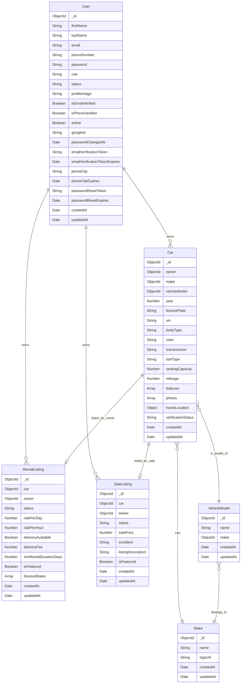

# Habesha Ride Backend v2 - Database Schema & Entity Relationship Diagram

## Database Schema Documentation

This document provides a comprehensive Entity Relationship Diagram (ERD) and detailed schema documentation for all Mongoose models in the Habesha Ride application.

---

## Entity Relationship Diagram (ERD)



---

## Relationship Details

### 1. User → Car (One-to-Many)

**Type**: `||--o{` (One User can own zero or many Cars)

- **Foreign Key**: `Car.owner` references `User._id`
- **Cardinality**: One User can have multiple Cars
- **Business Logic**: Users can list multiple vehicles on the platform
- **Required**: Yes (every Car must have an owner)
- **Indexed**: Yes (`Car.owner` is indexed)

### 2. User → RentalListing (One-to-Many)

**Type**: `||--o{` (One User can own zero or many RentalListings)

- **Foreign Key**: `RentalListing.owner` references `User._id`
- **Cardinality**: One User can have multiple RentalListings
- **Business Logic**: Users can list multiple cars for rental
- **Required**: Yes (every RentalListing must have an owner)
- **Indexed**: Yes (composite index with status)

### 3. User → SaleListing (One-to-Many)

**Type**: `||--o{` (One User can own zero or many SaleListings)

- **Foreign Key**: `SaleListing.owner` references `User._id`
- **Cardinality**: One User can have multiple SaleListings
- **Business Logic**: Users can list multiple cars for sale
- **Required**: Yes (every SaleListing must have an owner)
- **Indexed**: Yes (composite index with status)

### 4. Car → RentalListing (One-to-Zero-or-One)

**Type**: `||--o|` (One Car can have zero or one RentalListing)

- **Foreign Key**: `RentalListing.car` references `Car._id`
- **Cardinality**: One Car can have at most one RentalListing
- **Constraint**: **UNIQUE** constraint on `RentalListing.car`
- **Business Logic**: A car can only be listed for rental once at a time
- **Required**: Yes (in RentalListing)
- **Note**: A car may not have a RentalListing if it's not being rented

### 5. Car → SaleListing (One-to-Zero-or-One)

**Type**: `||--o|` (One Car can have zero or one SaleListing)

- **Foreign Key**: `SaleListing.car` references `Car._id`
- **Cardinality**: One Car can have at most one SaleListing
- **Constraint**: **UNIQUE** constraint on `SaleListing.car`
- **Business Logic**: A car can only be listed for sale once at a time
- **Required**: Yes (in SaleListing)
- **Note**: A car may not have a SaleListing if it's not being sold

### 6. Make → VehicleModel (One-to-Many)

**Type**: `||--o{` (One Make has zero or many VehicleModels)

- **Foreign Key**: `VehicleModel.make` references `Make._id`
- **Cardinality**: One Make can have multiple VehicleModels
- **Business Logic**: Each manufacturer (Make) has multiple vehicle models
- **Example**: Toyota (Make) → Camry, Corolla, RAV4 (VehicleModels)
- **Required**: Yes (every VehicleModel must belong to a Make)
- **Indexed**: Yes (composite unique index with name)

### 7. Car → Make (Many-to-One)

**Type**: `}o--||` (Many Cars have exactly one Make)

- **Foreign Key**: `Car.make` references `Make._id`
- **Cardinality**: Many Cars belong to one Make
- **Business Logic**: Each car is manufactured by one company
- **Required**: Yes (every Car must have a Make)
- **Example**: Multiple Cars can be Toyota

### 8. Car → VehicleModel (Many-to-One)

**Type**: `}o--||` (Many Cars have exactly one VehicleModel)

- **Foreign Key**: `Car.vehicleModel` references `VehicleModel._id`
- **Cardinality**: Many Cars have one VehicleModel
- **Business Logic**: Each car is a specific model
- **Required**: Yes (every Car must have a VehicleModel)
- **Example**: Multiple Cars can be "Toyota Camry"

### 9. VehicleModel → Make (Many-to-One)

**Type**: `}o--||` (Many VehicleModels belong to exactly one Make)

- **Foreign Key**: `VehicleModel.make` references `Make._id`
- **Cardinality**: Many VehicleModels belong to one Make
- **Business Logic**: Each vehicle model is produced by one manufacturer
- **Required**: Yes (every VehicleModel must belong to a Make)
- **Indexed**: Yes (composite unique index with name)

---

## Detailed Schema Documentation

### 1. User Schema

**Collection Name**: `users`

**Description**: Stores user accounts with authentication and profile information.

#### Fields

| Field                           | Type          | Required      | Unique       | Default     | Description                                       |
| ------------------------------- | ------------- | ------------- | ------------ | ----------- | ------------------------------------------------- |
| `_id`                           | ObjectId      | Auto          | Yes          | Auto        | Primary key                                       |
| `firstName`                     | String        | Yes           | No           | -           | User's first name (2-50 chars)                    |
| `lastName`                      | String        | Yes           | No           | -           | User's last name (2-50 chars)                     |
| `email`                         | String        | Yes           | Yes          | -           | User's email (validated, lowercase)               |
| `phoneNumber`                   | String        | Conditional\* | Yes          | -           | Phone number (required for email/password signup) |
| `password`                      | String        | Conditional\* | No           | -           | Hashed password (bcrypt, 12 rounds)               |
| `role`                          | String (enum) | Yes           | No           | 'user'      | User role: user, admin, superadmin                |
| `status`                        | String (enum) | Yes           | No           | 'pending'   | Account status: pending, approved, blocked        |
| `profileImage`                  | String        | No            | No           | Default URL | Cloudinary URL for profile picture                |
| `isEmailVerified`               | Boolean       | Yes           | No           | false       | Email verification status                         |
| `isPhoneVerified`               | Boolean       | Yes           | No           | false       | Phone verification status                         |
| `active`                        | Boolean       | Yes           | No           | true        | Account active status (soft delete)               |
| `googleId`                      | String        | No            | Yes (sparse) | -           | Google OAuth ID                                   |
| `passwordChangedAt`             | Date          | No            | No           | -           | Timestamp of last password change                 |
| `emailVerificationToken`        | String        | No            | No           | -           | Hashed email verification token                   |
| `emailVerificationTokenExpires` | Date          | No            | No           | -           | Token expiry (24 hours)                           |
| `phoneOtp`                      | String        | No            | No           | -           | Hashed phone OTP                                  |
| `phoneOtpExpires`               | Date          | No            | No           | -           | OTP expiry (5 minutes)                            |
| `passwordResetToken`            | String        | No            | No           | -           | Hashed password reset token                       |
| `passwordResetExpires`          | Date          | No            | No           | -           | Token expiry (10 minutes)                         |
| `createdAt`                     | Date          | Auto          | No           | Auto        | Record creation timestamp                         |
| `updatedAt`                     | Date          | Auto          | No           | Auto        | Record update timestamp                           |

\*Conditional: Required unless user signed up with Google OAuth

#### Indexes

- `{ email: 1 }` - Unique index
- `{ phoneNumber: 1 }` - Unique sparse index
- `{ googleId: 1 }` - Unique sparse index
- `{ role: 1, status: 1 }` - Compound index
- Text index on `firstName`, `lastName`, `email`

#### Virtual Fields

- `fullName`: Computed as `firstName + ' ' + lastName`

#### Middleware/Hooks

- **Pre-save**: Hashes password using bcrypt (12 rounds) if modified
- **Pre-find**: Filters out inactive users by default

#### Instance Methods

- `comparePassword(candidatePassword)`: Compare plain password with hashed
- `hasPasswordChangedAfter(JWTTimestamp)`: Check if password changed after JWT issue
- `createEmailVerificationToken()`: Generate and hash email verification token
- `createPhoneOtp()`: Generate and hash 6-digit OTP
- `createPasswordResetToken()`: Generate and hash password reset token

---

### 2. Car Schema

**Collection Name**: `cars`

**Description**: Stores vehicle information owned by users.

#### Fields

| Field                | Type          | Required | Unique       | Default   | Description                                     |
| -------------------- | ------------- | -------- | ------------ | --------- | ----------------------------------------------- |
| `_id`                | ObjectId      | Auto     | Yes          | Auto      | Primary key                                     |
| `owner`              | ObjectId      | Yes      | No           | -         | Reference to User (FK)                          |
| `make`               | ObjectId      | Yes      | No           | -         | Reference to Make (FK)                          |
| `vehicleModel`       | ObjectId      | Yes      | No           | -         | Reference to VehicleModel (FK)                  |
| `year`               | Number        | Yes      | No           | -         | Vehicle year (1900 - current year + 1)          |
| `licensePlate`       | String        | Yes      | Yes          | -         | Vehicle license plate (uppercase)               |
| `vin`                | String        | No       | Yes (sparse) | -         | Vehicle Identification Number                   |
| `bodyType`           | String (enum) | No       | No           | -         | sedan, suv, truck, hatchback, coupe, van, other |
| `color`              | String        | No       | No           | -         | Vehicle color                                   |
| `transmission`       | String (enum) | No       | No           | -         | automatic, manual                               |
| `fuelType`           | String (enum) | No       | No           | -         | gasoline, diesel, electric, hybrid              |
| `seatingCapacity`    | Number        | No       | No           | -         | Number of seats (min: 1)                        |
| `mileage`            | Number        | No       | No           | -         | Vehicle mileage (min: 0)                        |
| `features`           | Array[String] | No       | No           | []        | List of vehicle features                        |
| `photos`             | Array[Object] | Yes      | No           | -         | 1-10 photos (url, publicId, isPrimary)          |
| `homeLocation`       | Object        | Yes      | No           | -         | { address, city }                               |
| `verificationStatus` | String (enum) | Yes      | No           | 'pending' | pending, approved, rejected                     |
| `createdAt`          | Date          | Auto     | No           | Auto      | Record creation timestamp                       |
| `updatedAt`          | Date          | Auto     | No           | Auto      | Record update timestamp                         |

#### Embedded Schemas

**Photo Schema**:

```typescript
{
  url: String (required) - Cloudinary URL
  publicId: String (required) - Cloudinary public ID
  isPrimary: Boolean (default: false) - Primary photo flag
}
```

**Location Schema**:

```typescript
{
  address: String (required) - Street address
  city: String (required) - City name
}
```

#### Indexes

- `{ owner: 1 }` - Index on owner
- `{ verificationStatus: 1 }` - Index on verification status
- Text index on `make`, `vehicleModel`, `homeLocation.city`

#### Middleware/Hooks

- **Pre-save**: Trims whitespace from features array

#### Validation

- Photos: Must have 1-10 photos
- Year: Must be between 1900 and next year
- Mileage: Cannot be negative
- Seating capacity: Must be at least 1

---

### 3. RentalListing Schema

**Collection Name**: `rentallistings`

**Description**: Stores rental listing information for cars available for rent.

#### Fields

| Field                   | Type          | Required      | Unique | Default  | Description                                   |
| ----------------------- | ------------- | ------------- | ------ | -------- | --------------------------------------------- |
| `_id`                   | ObjectId      | Auto          | Yes    | Auto     | Primary key                                   |
| `car`                   | ObjectId      | Yes           | Yes    | -        | Reference to Car (FK) - UNIQUE                |
| `owner`                 | ObjectId      | Yes           | No     | -        | Reference to User (FK)                        |
| `status`                | String (enum) | Yes           | No     | 'listed' | listed, unlisted, paused                      |
| `ratePerDay`            | Number        | Yes           | No     | -        | Daily rental rate (min: 0)                    |
| `ratePerHour`           | Number        | No            | No     | -        | Hourly rental rate (min: 0)                   |
| `deliveryAvailable`     | Boolean       | Yes           | No     | false    | Is delivery available?                        |
| `deliveryFee`           | Number        | Conditional\* | No     | -        | Delivery fee (required if delivery available) |
| `minRentalDurationDays` | Number        | Yes           | No     | 1        | Minimum rental days (min: 1)                  |
| `isFeatured`            | Boolean       | Yes           | No     | false    | Featured listing flag                         |
| `blockedDates`          | Array[Date]   | No            | No     | []       | Dates when car is unavailable                 |
| `createdAt`             | Date          | Auto          | No     | Auto     | Record creation timestamp                     |
| `updatedAt`             | Date          | Auto          | No     | Auto     | Record update timestamp                       |

\*Conditional: Required if `deliveryAvailable` is true

#### Indexes

- `{ car: 1 }` - Unique index (ensures one rental listing per car)
- `{ owner: 1, status: 1 }` - Compound index
- `{ status: 1, isFeatured: 1 }` - Compound index

#### Business Rules

- One car can only have one active rental listing
- Delivery fee is mandatory if delivery is available
- Minimum rental duration must be at least 1 day

---

### 4. SaleListing Schema

**Collection Name**: `salelistings`

**Description**: Stores sale listing information for cars available for sale.

#### Fields

| Field                | Type          | Required | Unique | Default     | Description                              |
| -------------------- | ------------- | -------- | ------ | ----------- | ---------------------------------------- |
| `_id`                | ObjectId      | Auto     | Yes    | Auto        | Primary key                              |
| `car`                | ObjectId      | Yes      | Yes    | -           | Reference to Car (FK) - UNIQUE           |
| `owner`              | ObjectId      | Yes      | No     | -           | Reference to User (FK)                   |
| `status`             | String (enum) | Yes      | No     | 'available' | available, pending, sold                 |
| `salePrice`          | Number        | Yes      | No     | -           | Sale price (min: 0)                      |
| `condition`          | String (enum) | Yes      | No     | -           | new, used_like_new, used_good, used_fair |
| `listingDescription` | String        | Yes      | No     | -           | Sale description (max: 2000 chars)       |
| `isFeatured`         | Boolean       | Yes      | No     | false       | Featured listing flag                    |
| `createdAt`          | Date          | Auto     | No     | Auto        | Record creation timestamp                |
| `updatedAt`          | Date          | Auto     | No     | Auto        | Record update timestamp                  |

#### Indexes

- `{ car: 1 }` - Unique index (ensures one sale listing per car)
- `{ owner: 1, status: 1 }` - Compound index
- `{ status: 1, isFeatured: 1 }` - Compound index

#### Business Rules

- One car can only have one active sale listing
- Description is required and limited to 2000 characters
- Price must be non-negative

---

### 5. Make Schema

**Collection Name**: `makes`

**Description**: Stores vehicle manufacturer information.

#### Fields

| Field       | Type     | Required | Unique | Default | Description                        |
| ----------- | -------- | -------- | ------ | ------- | ---------------------------------- |
| `_id`       | ObjectId | Auto     | Yes    | Auto    | Primary key                        |
| `name`      | String   | Yes      | Yes    | -       | Manufacturer name (e.g., "Toyota") |
| `logoUrl`   | String   | No       | No     | -       | URL to manufacturer logo           |
| `createdAt` | Date     | Auto     | No     | Auto    | Record creation timestamp          |
| `updatedAt` | Date     | Auto     | No     | Auto    | Record update timestamp            |

#### Indexes

- `{ name: 1 }` - Unique index

#### Examples

- Toyota
- Honda
- Ford
- BMW
- Mercedes-Benz

---

### 6. VehicleModel Schema

**Collection Name**: `vehiclemodels`

**Description**: Stores specific vehicle model information.

#### Fields

| Field       | Type     | Required | Unique | Default | Description                |
| ----------- | -------- | -------- | ------ | ------- | -------------------------- |
| `_id`       | ObjectId | Auto     | Yes    | Auto    | Primary key                |
| `name`      | String   | Yes      | No     | -       | Model name (e.g., "Camry") |
| `make`      | ObjectId | Yes      | No     | -       | Reference to Make (FK)     |
| `createdAt` | Date     | Auto     | No     | Auto    | Record creation timestamp  |
| `updatedAt` | Date     | Auto     | No     | Auto    | Record update timestamp    |

#### Indexes

- `{ make: 1, name: 1 }` - Compound unique index (one model name per make)

#### Business Rules

- Model names must be unique within a make
- Examples:
  - Make: Toyota, Model: Camry
  - Make: Toyota, Model: Corolla
  - Make: Honda, Model: Civic

---

## Common Patterns

### 1. Mongoose Sanitize Plugin

All models use the `mongoose-sanitize` plugin to prevent NoSQL injection attacks by removing any keys that start with `$` or contain `.`.

### 2. Timestamps

All models have automatic `createdAt` and `updatedAt` timestamps enabled via:

```typescript
{
  timestamps: true;
}
```

### 3. Indexing Strategy

- **Unique indexes** on business keys (email, licensePlate, etc.)
- **Compound indexes** for frequent queries (owner + status)
- **Text indexes** for search functionality
- **Sparse indexes** for optional unique fields (googleId, vin)

### 4. Validation

- Schema-level validation for data types and constraints
- Custom validators for complex business rules
- Conditional required fields based on other field values

### 5. References (Foreign Keys)

All references use `Schema.Types.ObjectId` with `ref` to enable population:

```typescript
owner: {
  type: Schema.Types.ObjectId,
  ref: 'User',
  required: true
}
```

---

## Query Examples

### Get User with All Their Cars

```typescript
const user = await User.findById(userId);
const userCars = await Car.find({ owner: userId })
  .populate('make')
  .populate('vehicleModel');
```

### Get Car with Rental and Sale Listings

```typescript
const car = await Car.findById(carId)
  .populate('owner')
  .populate('make')
  .populate('vehicleModel');

const rentalListing = await RentalListing.findOne({ car: carId });
const saleListing = await SaleListing.findOne({ car: carId });
```

### Get All VehicleModels for a Make

```typescript
const toyotaModels = await VehicleModel.find({ make: toyotaMakeId });
```

### Get Featured Rental Listings

```typescript
const featuredRentals = await RentalListing.find({
  status: 'listed',
  isFeatured: true,
})
  .populate({
    path: 'car',
    populate: [{ path: 'make' }, { path: 'vehicleModel' }],
  })
  .populate('owner');
```

---

## Data Integrity Rules

### 1. Cascading Deletes (To Be Implemented)

When a User is deleted:

- All their Cars should be deleted
- All their RentalListings should be deleted
- All their SaleListings should be deleted

When a Car is deleted:

- Associated RentalListing should be deleted
- Associated SaleListing should be deleted

When a Make is deleted:

- Consider preventing deletion if VehicleModels exist
- Or cascade delete to VehicleModels

### 2. Unique Constraints

- One user per email
- One user per phone number
- One car per license plate
- One rental listing per car
- One sale listing per car
- One model name per make

### 3. Required References

- Every Car must have an owner (User)
- Every Car must have a make (Make)
- Every Car must have a vehicleModel (VehicleModel)
- Every RentalListing must have a car and owner
- Every SaleListing must have a car and owner
- Every VehicleModel must have a make

---

## Future Considerations

### Potential New Collections

1. **Booking/Reservation** - Track rental bookings
2. **Transaction** - Track sale transactions
3. **Review** - User reviews for cars/owners
4. **Message** - User-to-user messaging
5. **Notification** - System notifications
6. **Payment** - Payment information

### Potential Schema Enhancements

1. Add soft delete to more models
2. Add versioning for audit trails
3. Add geospatial indexes for location-based queries
4. Add full-text search optimization
5. Add caching strategy for frequently accessed data

---

**Version**: 2.0 MVP  
**Last Updated**: November 2025  
**Database**: MongoDB Atlas with Mongoose ODM  
**Total Collections**: 6 (User, Car, RentalListing, SaleListing, Make, VehicleModel)
