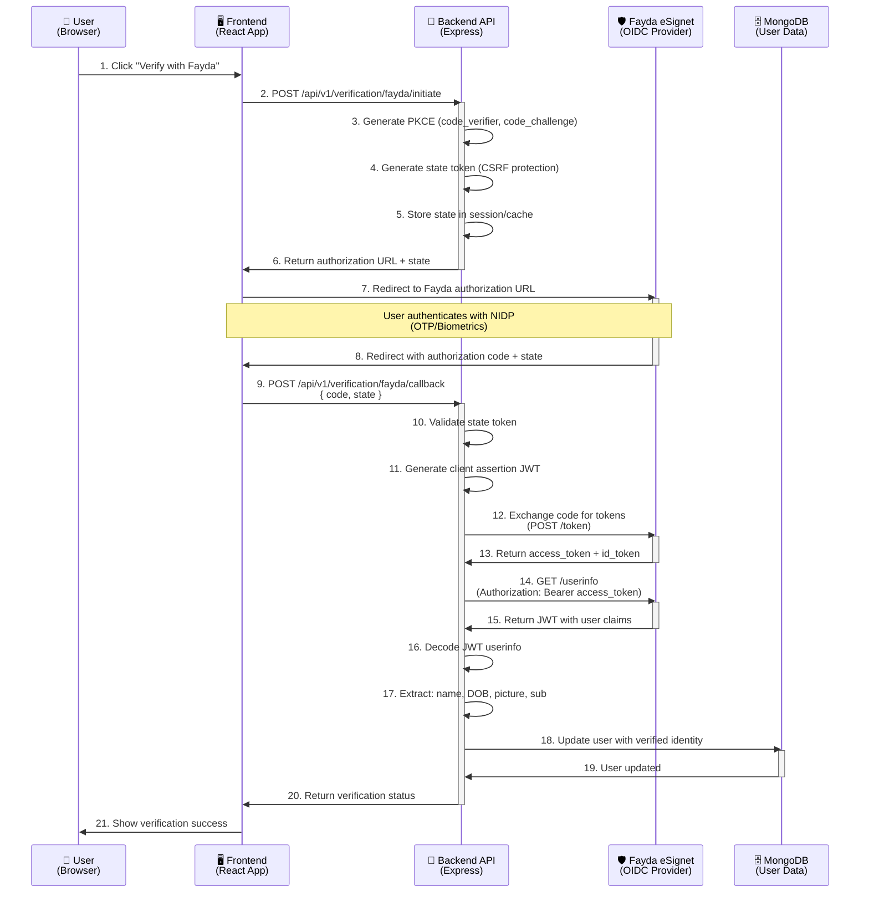

# Identity Verification Implementation Plan - Fayda (eSignet) Integration

**Version:** 1.0  
**Date:** December 11, 2025  
**Status:** Planning Phase  
**Module:** Identity & Security - National ID Verification

---

## 1. Executive Summary

This document outlines the technical implementation plan for integrating **Fayda (eSignet) OIDC** authentication to enable national ID verification for Ethiopian citizens and residents on the Kech.ai platform. This implementation fulfills **Path A: The Resident Flow** as defined in the Kech.ai Verification Standard.

### 1.1 Objectives

- ✅ Implement OIDC authorization code flow with PKCE for secure authentication
- ✅ Integrate with Fayda eSignet endpoints for identity verification
- ✅ Store verified user identity data (name, DOB, photo) from government database
- ✅ Track verification status in user model
- ✅ Provide secure callback handling for OAuth flow
- ✅ Implement JWT client assertion for token exchange
- ✅ Support multi-language claims (English/Amharic)

### 1.2 Scope

**In Scope:**

- Fayda OIDC integration (authorization, token exchange, userinfo retrieval)
- Database schema updates for identity verification
- API endpoints for initiating and handling verification
- Security implementation (PKCE, client assertion, state validation)
- Error handling and logging

**Out of Scope (Future Phases):**

- License OCR verification (Phase 2)
- Passport verification for visitors (Phase 3)
- Physical handover workflow (Phase 4)

### 1.3 Critical Implementation Adjustments

**⚠️ Before implementation, ensure these three optimizations are incorporated:**

1. **Temporary State Storage**: Use httpOnly signed cookies for PKCE state/code_verifier (NOT MongoDB) - See Section 3.2
2. **Duplicate Identity Check**: Prevent one Fayda ID from linking to multiple accounts - See Section 4.1.2
3. **Axios Timeout**: Set 30-second timeout for Fayda API calls (government systems can be slow) - See Section 5.2

---

## 2. Architecture Overview

### 2.1 System Integration Flow



### 2.2 Component Architecture

```
src/
├── config/
│   └── env.config.ts                    # Add Fayda configuration
├── models/
│   └── user.model.ts                    # Add identity verification fields
├── services/
│   └── verification.service.ts          # NEW: Verification business logic (orchestrates utils + DB)
├── controllers/
│   └── verification.controller.ts       # NEW: Verification endpoints
├── routes/
│   └── verification.routes.ts           # NEW: Verification routes
├── middleware/
│   └── verification.middleware.ts       # NEW: Verification checks
├── utils/
│   ├── fayda.util.ts                    # NEW: Fayda API client (pure third-party integration)
│   └── pkce.util.ts                     # NEW: PKCE generation helpers
├── validation/
│   └── verification.schema.ts           # NEW: Verification schemas
└── types/
    └── verification.types.ts             # NEW: Verification types
```

**Architecture Pattern:**

- **Utils**: Third-party service clients (like `google.util.ts`, `chapa.util.ts`) - pure API wrappers
- **Services**: Business logic that orchestrates utils + database interactions (like `auth.service.ts` uses `google.util.ts`)

---

## 3. Database Schema Changes

### 3.1 User Model Extensions

**New Fields to Add:**

```typescript
// Identity Verification Fields
faydaId?: string;                        // Fayda subject ID (sub claim)
isIdentityVerified: boolean;              // Identity verification status
identityVerifiedAt?: Date;                // Timestamp of verification
identityVerificationMethod?: string;     // 'fayda' | 'passport' | null

// Fayda Identity Data (from userinfo endpoint)
faydaData?: {
  sub: string;                           // Fayda subject identifier
  name?: string;                         // Full name (or name#en, name#am)
  nameEn?: string;                       // English name (if multi-lang)
  nameAm?: string;                       // Amharic name (if multi-lang)
  birthdate?: string;                    // Date of birth (YYYY-MM-DD)
  picture?: string;                      // Profile photo URL
  gender?: string;                       // Gender (if available)
  address?: string;                      // Address (if available)
  phone_number?: string;                 // Phone (if available)
  email?: string;                        // Email (if available)
  verifiedAt: Date;                     // When data was verified
};
```

**⚠️ Important:** Temporary OAuth state (code_verifier, state token) should NOT be stored in the database. Use httpOnly cookies instead (see Section 3.3).

**Indexes to Add:**

```typescript
userSchema.index({ faydaId: 1 }, { unique: true, sparse: true });
userSchema.index({ isIdentityVerified: 1 });
userSchema.index({ identityVerifiedAt: 1 });
```

### 3.2 Temporary State Management (PKCE & State Tokens)

**⚠️ Do NOT store temporary OAuth state in MongoDB.**

Temporary data (code_verifier, state token) should be stored in **httpOnly signed cookies** for the following reasons:

- **Ephemeral Nature**: Only needed for 5-10 minutes during OAuth flow
- **Database Efficiency**: Avoids unnecessary write operations
- **Data Cleanup**: No orphaned data if users abandon the flow
- **Stateless Backend**: Keeps backend stateless

**Implementation:**

```typescript
// In verification.controller.ts - initiateFaydaVerification handler

// Generate PKCE and state
const codeVerifier = generateCodeVerifier();
const codeChallenge = generateCodeChallenge(codeVerifier);
const state = crypto.randomBytes(32).toString('base64url');

// Store in httpOnly signed cookie (10 minute expiration)
res.cookie('fayda_verification_state', state, {
  httpOnly: true,
  secure: process.env.NODE_ENV === 'production',
  sameSite: 'strict',
  maxAge: 10 * 60 * 1000, // 10 minutes
  signed: true, // Requires cookie-parser with secret
});

res.cookie('fayda_code_verifier', codeVerifier, {
  httpOnly: true,
  secure: process.env.NODE_ENV === 'production',
  sameSite: 'strict',
  maxAge: 10 * 60 * 1000,
  signed: true,
});
```

**Cookie Retrieval in Callback:**

```typescript
// In verification.controller.ts - handleFaydaCallback handler

const state = req.signedCookies.fayda_verification_state;
const codeVerifier = req.signedCookies.fayda_code_verifier;

// Validate state matches request
if (!state || state !== req.body.state) {
  throw new AppError('Invalid or missing state token', 401);
}

// Clear cookies after use
res.clearCookie('fayda_verification_state');
res.clearCookie('fayda_code_verifier');
```

**Alternative (If Redis Available):**

If using Redis, store with TTL:

```typescript
await redis.setex(`fayda:state:${userId}`, 600, state); // 10 min TTL
await redis.setex(`fayda:verifier:${userId}`, 600, codeVerifier);
```

### 3.3 Migration Strategy

1. **Add fields with defaults** (backward compatible)
2. **Existing users**: `isIdentityVerified: false`
3. **No breaking changes** to existing API responses
4. **Gradual migration** as users verify

---

## 4. API Endpoints Design

### 4.1 Verification Routes

**Base Path:** `/api/v1/verification`

#### 4.1.1 Initiate Fayda Verification

**Endpoint:** `POST /api/v1/verification/fayda/initiate`

**Authentication:** Required (JWT cookie)

**Request Body:** None (uses authenticated user)

**Response:**

```json
{
  "status": "success",
  "data": {
    "authorizationUrl": "https://esignet.authorization.endpoint/authorize?client_id=...&...",
    "state": "random_state_token_here",
    "expiresIn": 600
  }
}
```

**Purpose:**

- Generate PKCE parameters (code_verifier, code_challenge)
- Generate state token for CSRF protection
- Build authorization URL with all required parameters
- Store state/code_verifier temporarily (session or Redis)

**Error Responses:**

- `401`: Not authenticated
- `400`: User already verified
- `500`: Failed to generate authorization URL

---

#### 4.1.2 Handle Fayda Callback

**Endpoint:** `POST /api/v1/verification/fayda/callback`

**Authentication:** Required (JWT cookie)

**Request Body:**

```json
{
  "code": "authorization_code_from_fayda",
  "state": "state_token_from_initiate"
}
```

**Response:**

```json
{
  "status": "success",
  "data": {
    "user": {
      "id": "...",
      "isIdentityVerified": true,
      "faydaData": {
        "name": "John Doe",
        "birthdate": "1990-01-01",
        "picture": "https://..."
      }
    },
    "message": "Identity verified successfully"
  }
}
```

**Purpose:**

- Validate state token (CSRF protection)
- Exchange authorization code for tokens
- Retrieve userinfo from Fayda
- Decode and store verified identity data
- Update user model

**Error Responses:**

- `401`: Not authenticated or invalid state
- `400`: Invalid authorization code or expired state
- `409`: User already verified with different Fayda ID, or Fayda ID already linked to another account
- `500`: Fayda API error or token exchange failure

**⚠️ Security Check - Duplicate Identity Prevention:**

Before updating the user, check if the Fayda ID is already linked to a different account:

```typescript
// In verification.service.ts - handleFaydaCallback

const existingUser = await User.findOne({ faydaId: profile.sub });

if (existingUser && existingUser.id !== userId) {
  throw new AppError(
    'This Fayda ID is already linked to another account.',
    409,
  );
}
```

This prevents one person from verifying multiple accounts with the same Fayda ID.

---

#### 4.1.3 Get Verification Status

**Endpoint:** `GET /api/v1/verification/status`

**Authentication:** Required (JWT cookie)

**Response:**

```json
{
  "status": "success",
  "data": {
    "isIdentityVerified": true,
    "identityVerificationMethod": "fayda",
    "identityVerifiedAt": "2025-12-11T10:30:00Z",
    "faydaId": "fayda_sub_identifier",
    "faydaData": {
      "name": "John Doe",
      "birthdate": "1990-01-01",
      "picture": "https://..."
    }
  }
}
```

**Purpose:**

- Return current verification status for authenticated user
- Used by frontend to show verification badge/status

---

#### 4.1.4 Revoke Verification (Admin Only)

**Endpoint:** `DELETE /api/v1/verification/fayda/:userId`

**Authentication:** Required (Admin/Superadmin)

**Purpose:**

- Admin can revoke verification if fraud detected
- Sets `isIdentityVerified: false` and clears `faydaData`

---

## 5. Service Layer Implementation

### 5.1 Verification Service (`verification.service.ts`)

**Location:** `src/services/verification.service.ts` (follows pattern: `auth.service.ts`, `payment.service.ts`)

**Responsibilities:**

- Orchestrate verification flow (business logic)
- Coordinate with `fayda.util.ts` (third-party API calls)
- Interact with User model (database operations)
- Manage verification state and validation
- Handle duplicate identity checks

**Key Methods:**

```typescript
export const initiateFaydaVerification = async (userId: string) => {
  // 1. Check if user already verified
  // 2. Generate PKCE parameters
  // 3. Generate state token
  // 4. Store state/code_verifier (session/Redis)
  // 5. Build authorization URL
  // 6. Return authorization URL + state
};

export const handleFaydaCallback = async (
  userId: string,
  code: string,
  state: string,
  codeVerifier: string, // Retrieved from signed cookie
) => {
  // 1. Validate state token (from signed cookie)
  // 2. Check if user already verified
  // 3. Import fayda.util functions
  // 4. Call faydaUtil.generateClientAssertion()
  // 5. Call faydaUtil.exchangeCodeForTokens()
  // 6. Call faydaUtil.getUserInfo()
  // 7. Decode and validate userinfo JWT
  // 8. Check for duplicate Fayda ID (security check - User.findOne)
  // 9. Update User model with verified data (database operation)
  // 10. Return verification result
};

export const getVerificationStatus = async (userId: string) => {
  // 1. Fetch user with verification data
  // 2. Return status and faydaData
};
```

### 5.2 Fayda Utility (`fayda.util.ts`)

**Location:** `src/utils/fayda.util.ts` (follows pattern: `google.util.ts`, `chapa.util.ts`)

**Responsibilities:**

- Pure third-party API client for Fayda eSignet
- Token exchange (HTTP calls to Fayda)
- Userinfo retrieval (HTTP calls to Fayda)
- JWT client assertion generation
- No database interactions (pure API wrapper)

**Key Methods:**

```typescript
// Configure axios instance with generous timeout for government systems
import axios, { AxiosInstance } from 'axios';
import config from '../config/env.config.js';

const faydaClient: AxiosInstance = axios.create({
  baseURL: config.fayda.tokenEndpoint.split('/token')[0], // Base URL
  timeout: 30000, // 30 seconds - government systems can be slow
  headers: {
    'Content-Type': 'application/x-www-form-urlencoded',
  },
});

export const exchangeCodeForTokens = async (
  code: string,
  codeVerifier: string,
  redirectUri: string,
  clientAssertion: string,
) => {
  // 1. POST to token endpoint using faydaClient
  // 2. Return access_token and id_token
};

export const getUserInfo = async (accessToken: string) => {
  // 1. GET /userinfo with Bearer token using faydaClient
  // 2. Return JWT userinfo response
};

export const generateClientAssertion = async () => {
  // 1. Decode Base64 private key
  // 2. Import JWK
  // 3. Sign JWT with RS256
  // 4. Return signed JWT
};
```

**⚠️ Timeout Configuration:**

Government ID systems (MOSIP implementations) can be slow under load. Set explicit timeout to 30,000ms (30 seconds) to avoid premature failures during token exchange.

**Pattern Consistency:**

- Similar to `chapa.util.ts` (axios client for Chapa API)
- Similar to `google.util.ts` (OAuth client for Google)
- Pure API wrapper, no database interactions

export const generateClientAssertion = async () => {
// 1. Decode Base64 private key
// 2. Import JWK
// 3. Sign JWT with RS256
// 4. Return signed JWT
};

````

### 5.3 PKCE Utility (`pkce.util.ts`)

**Responsibilities:**

- Generate code_verifier
- Generate code_challenge (SHA-256 + Base64 URL-safe)

```typescript
export const generateCodeVerifier = (): string => {
  // Generate 43-128 character random string
  // Base64 URL-safe encoding
};

export const generateCodeChallenge = (verifier: string): string => {
  // SHA-256 hash of verifier
  // Base64 URL-safe encoding
};
````

### 5.3 PKCE Utility (`pkce.util.ts`)

**Location:** `src/utils/pkce.util.ts`

**Responsibilities:**

- Generate code_verifier
- Generate code_challenge (SHA-256 + Base64 URL-safe)

```typescript
export const generateCodeVerifier = (): string => {
  // Generate 43-128 character random string
  // Base64 URL-safe encoding
};

export const generateCodeChallenge = (verifier: string): string => {
  // SHA-256 hash of verifier
  // Base64 URL-safe encoding
};
```

### 5.4 Fayda Utility Helpers

**Location:** `src/utils/fayda.util.ts` (additional helper functions)

**Responsibilities:**

- Build authorization URLs
- Decode JWT tokens (without verification for userinfo)
- Parse multi-language claims

```typescript
export const buildAuthorizationUrl = (
  codeChallenge: string,
  state: string,
  claims?: object,
): string => {
  // Construct authorization URL with all parameters
};

export const decodeUserInfoJWT = (jwt: string) => {
  // Decode without signature verification
  // Handle multi-language claims (name#en, name#am)
  // Return parsed user data
};
```

---

## 6. Configuration & Environment Variables

### 6.1 Environment Variables

**Add to `config.env`:**

```env
# ====================================
# FAYDA (eSignet) CONFIGURATION
# ====================================
FAYDA_CLIENT_ID=your_esignet_client_id
FAYDA_AUTHORIZATION_ENDPOINT=https://esignet.authorization.endpoint/authorize
FAYDA_TOKEN_ENDPOINT=https://esignet.token.endpoint/token
FAYDA_USERINFO_ENDPOINT=https://esignet.userinfo.endpoint/userinfo
FAYDA_REDIRECT_URI=https://yourapp.com/api/v1/verification/fayda/callback
FAYDA_PRIVATE_KEY_BASE64=base64_encoded_jwk_private_key
FAYDA_CLAIMS_LOCALES=en am
```

### 6.2 Config Type Updates

**Add to `src/types/config.types.ts`:**

```typescript
interface FaydaConfig {
  clientId: string;
  authorizationEndpoint: string;
  tokenEndpoint: string;
  userinfoEndpoint: string;
  redirectUri: string;
  privateKeyBase64: string;
  claimsLocales: string; // e.g., "en am"
}

export interface AppConfig {
  // ... existing config
  fayda: FaydaConfig;
}
```

**Update `src/config/env.config.ts`:**

```typescript
fayda: {
  clientId: getEnvVar('FAYDA_CLIENT_ID', true)!,
  authorizationEndpoint: getEnvVar('FAYDA_AUTHORIZATION_ENDPOINT', true)!,
  tokenEndpoint: getEnvVar('FAYDA_TOKEN_ENDPOINT', true)!,
  userinfoEndpoint: getEnvVar('FAYDA_USERINFO_ENDPOINT', true)!,
  redirectUri: getEnvVar('FAYDA_REDIRECT_URI', true)!,
  privateKeyBase64: getEnvVar('FAYDA_PRIVATE_KEY_BASE64', true)!,
  claimsLocales: getEnvVar('FAYDA_CLAIMS_LOCALES', false, 'en am')!,
},
```

---

## 7. Security Considerations

### 7.1 PKCE Implementation

- **Code Verifier**: 43-128 characters, cryptographically random
- **Code Challenge**: SHA-256 hash, Base64 URL-safe encoded
- **Storage**: Store code_verifier in httpOnly signed cookies (preferred) or Redis with expiration (10 minutes)
- **Validation**: Verify code_verifier matches code_challenge during token exchange
- **⚠️ Important**: Do NOT store in MongoDB - use cookies to keep backend stateless and avoid database clutter

### 7.2 State Token (CSRF Protection)

- **Generation**: Cryptographically random, 32+ bytes
- **Storage**: httpOnly signed cookies (preferred) or Redis with expiration (10 minutes)
- **Validation**: Must match exactly on callback
- **One-time use**: Clear cookies after successful validation
- **Why Cookies**: Keeps backend stateless, no database clutter, automatic cleanup

### 7.3 Client Assertion JWT

- **Algorithm**: RS256 (RSA with SHA-256)
- **Claims**: `iss`, `sub`, `aud`, `iat`, `exp`
- **Expiration**: 2 hours from issuance
- **Private Key**: Store securely (environment variable, never commit)
- **Validation**: Fayda verifies signature and claims

### 7.4 Data Privacy

- **Sensitive Data**: Store `faydaId`, `birthdate`, `picture` securely
- **Access Control**: Only authenticated user can view their own verification data
- **Admin Access**: Admins can view for fraud investigation
- **Data Retention**: Follow data protection regulations
- **Encryption**: Ensure database encryption at rest

### 7.5 Error Handling Security

- **No Information Leakage**: Don't expose internal errors to client
- **Rate Limiting**: Prevent brute force on verification endpoints
- **Logging**: Log security events (failed verifications, suspicious activity)
- **Audit Trail**: Track verification attempts and outcomes

---

## 8. Error Handling

### 8.1 Error Categories

#### 8.1.1 Validation Errors (400)

- Invalid authorization code
- Missing or invalid state token
- Expired state token
- User already verified

#### 8.1.2 Authentication Errors (401)

- Not authenticated (missing JWT)
- Invalid JWT token
- Expired session

#### 8.1.3 Authorization Errors (403)

- User account blocked/deactivated
- Admin-only endpoint access denied

#### 8.1.4 Conflict Errors (409)

- User already verified with different Fayda ID
- Duplicate verification attempt
- **Fayda ID already linked to another account** (critical security check)

#### 8.1.5 External Service Errors (502/503)

- Fayda API timeout
- Fayda API rate limiting
- Network connectivity issues
- Invalid client assertion

### 8.2 Error Response Format

```json
{
  "status": "error",
  "message": "Human-readable error message",
  "code": "VERIFICATION_FAILED",
  "details": {
    "faydaError": "invalid_assertion",
    "timestamp": "2025-12-11T10:30:00Z"
  }
}
```

### 8.3 Retry Strategy

- **Transient Errors**: Retry with exponential backoff (max 3 retries)
- **Permanent Errors**: Return error immediately
- **Rate Limiting**: Wait and retry after rate limit window

---

## 9. Dependencies

### 9.1 New NPM Packages

```json
{
  "dependencies": {
    "jose": "^5.0.0", // JWT signing/verification, JWK import
    "crypto": "^1.0.1" // Built-in Node.js (PKCE hashing)
  }
}
```

**Package Justification:**

- **jose**: Industry-standard JWT library, supports JWK import, RS256 signing
- **crypto**: Node.js built-in, no additional dependency needed for PKCE

### 9.2 Existing Dependencies (Already Installed)

- `jsonwebtoken`: For JWT decoding (if needed)
- `express`: Web framework
- `mongoose`: Database ODM
- `cors`, `helmet`: Security middleware

---

## 10. Implementation Phases

### Phase 1: Foundation (Week 1)

**Tasks:**

1. ✅ Add environment variables and config
2. ✅ Update user model with verification fields
3. ✅ Create PKCE utility functions
4. ✅ Create Fayda utility functions (JWT, URL building)
5. ✅ Set up basic project structure

**Deliverables:**

- Database migration complete
- Utilities tested and documented
- Config integrated

---

### Phase 2: Core Services (Week 1-2)

**Tasks:**

1. ✅ Implement `fayda.util.ts` (Fayda API client) with 30s timeout
2. ✅ Implement `verification.service.ts` (orchestration + DB) with duplicate ID check
3. ✅ Implement cookie-based state management (httpOnly signed cookies)
4. ✅ Implement client assertion JWT generation in `fayda.util.ts`

**Deliverables:**

- Services unit tested
- Integration with Fayda API verified
- Error handling implemented

---

### Phase 3: API Endpoints (Week 2)

**Tasks:**

1. ✅ Create verification routes
2. ✅ Create verification controller
3. ✅ Add validation schemas
4. ✅ Implement middleware (verification checks)
5. ✅ Add Swagger documentation

**Deliverables:**

- API endpoints functional
- Swagger docs complete
- Integration tests passing

---

### Phase 4: Security & Testing (Week 2-3)

**Tasks:**

1. ✅ Security audit (PKCE, state validation, JWT)
2. ✅ Rate limiting on verification endpoints
3. ✅ Comprehensive error handling
4. ✅ Unit tests (services, utilities)
5. ✅ Integration tests (API endpoints)
6. ✅ End-to-end tests (full flow)

**Deliverables:**

- Security review complete
- Test coverage > 80%
- Performance tested

---

### Phase 5: Documentation & Deployment (Week 3)

**Tasks:**

1. ✅ Update README with verification setup
2. ✅ API documentation (Swagger)
3. ✅ Developer guide (integration steps)
4. ✅ Deployment checklist
5. ✅ Monitoring and logging setup

**Deliverables:**

- Documentation complete
- Production deployment ready
- Monitoring configured

---

## 11. Testing Strategy

### 11.1 Unit Tests

**Files to Test:**

- `pkce.util.ts`: Code verifier/challenge generation
- `fayda.util.ts`: Token exchange, userinfo retrieval, JWT decoding, URL building
- `verification.service.ts`: Flow orchestration, database interactions

**Test Cases:**

- PKCE generation and validation
- Client assertion JWT signing
- JWT decoding (single and multi-language)
- State token validation
- Error handling scenarios

---

### 11.2 Integration Tests

**Test Scenarios:**

1. **Happy Path**: Full verification flow (initiate → callback → success)
2. **Invalid State**: Callback with invalid/expired state
3. **Invalid Code**: Callback with invalid authorization code
4. **Already Verified**: Attempt to verify already verified user
5. **Fayda API Errors**: Simulate Fayda API failures
6. **Network Timeouts**: Handle network issues gracefully

---

### 11.3 End-to-End Tests

**Test Flow:**

1. User authenticates
2. Initiates verification
3. Redirects to Fayda (mock or test environment)
4. Returns with authorization code
5. Completes verification
6. Verifies user data updated correctly

---

## 12. Monitoring & Logging

### 12.1 Key Metrics

- **Verification Success Rate**: % of successful verifications
- **Verification Failure Rate**: % of failed attempts
- **Average Verification Time**: Time from initiate to completion
- **Fayda API Latency**: Response times from Fayda endpoints
- **Error Rates by Type**: Categorize errors (validation, network, etc.)

### 12.2 Logging Events

**Info Level:**

- Verification initiated
- Verification completed successfully
- State token validated

**Warn Level:**

- Invalid state token
- Expired authorization code
- Fayda API rate limit warning

**Error Level:**

- Token exchange failure
- Userinfo retrieval failure
- JWT decoding errors
- Database update failures

**Security Events:**

- Multiple failed verification attempts
- State token mismatch
- Invalid client assertion

---

## 13. Future Enhancements

### 13.1 Phase 2: License OCR Verification

- Integrate Google Vision API for license OCR
- Match license name/DOB with Fayda data
- Store license verification status

### 13.2 Phase 3: Passport Verification (Visitor Flow)

- Passport MRZ reading
- International license support
- Visitor verification workflow

### 13.3 Phase 4: Physical Handover Integration

- Agent app integration
- Handover checklist API
- Face verification at pickup

---

## 14. Risk Assessment & Mitigation

### 14.1 Technical Risks

| Risk                    | Impact   | Probability | Mitigation                                           |
| ----------------------- | -------- | ----------- | ---------------------------------------------------- |
| Fayda API downtime      | High     | Medium      | Retry logic, graceful degradation, user notification |
| Private key compromise  | Critical | Low         | Secure storage, rotation policy, monitoring          |
| PKCE implementation bug | High     | Medium      | Thorough testing, code review, security audit        |
| State token collision   | Medium   | Low         | Cryptographically random, sufficient length          |
| JWT decoding errors     | Medium   | Low         | Robust error handling, fallback mechanisms           |

### 14.2 Business Risks

| Risk                  | Impact | Probability | Mitigation                                              |
| --------------------- | ------ | ----------- | ------------------------------------------------------- |
| Low user adoption     | Medium | Medium      | Clear UX, minimal friction, user education              |
| Verification fraud    | High   | Low         | Multi-layer verification, audit logs, admin review      |
| Data privacy concerns | High   | Low         | Compliance with regulations, transparent privacy policy |

---

## 15. Success Criteria

### 15.1 Functional Requirements

- ✅ Users can initiate Fayda verification
- ✅ OAuth flow completes successfully
- ✅ User identity data stored correctly
- ✅ Verification status tracked accurately
- ✅ Error handling works for all failure scenarios

### 15.2 Non-Functional Requirements

- ✅ API response time < 2 seconds (excluding Fayda redirect)
- ✅ 99.9% uptime for verification endpoints
- ✅ Zero security vulnerabilities (audit passed)
- ✅ Test coverage > 80%
- ✅ Documentation complete and accurate

---

## 16. Appendix

### 16.1 Fayda API Endpoints Reference

- **Authorization**: `https://esignet.authorization.endpoint/authorize`
- **Token Exchange**: `https://esignet.token.endpoint/token`
- **UserInfo**: `https://esignet.userinfo.endpoint/userinfo`

### 16.2 Required Claims

```json
{
  "userinfo": {
    "name": { "essential": true },
    "birthdate": { "essential": true },
    "picture": { "essential": true },
    "phone_number": { "essential": false },
    "email": { "essential": false },
    "gender": { "essential": false },
    "address": { "essential": false }
  },
  "id_token": {}
}
```

### 16.3 Multi-Language Claims Format

If `claims_locales: "en am"` is used:

- `name#en`: English name
- `name#am`: Amharic name
- `address#en`: English address
- `address#am`: Amharic address

### 16.4 ACR Values (Authentication Context)

- `mosip:idp:acr:generated-code`: OTP only
- `mosip:idp:acr:generated-code:biometrics`: OTP or Biometrics

---

## 17. References

- [Kech.ai Verification Standard](./README.md#-kechaiverification-standard)
- [Fayda eSignet Integration Documentation](./FAYDA_DOCUMENTATION.md) (to be created)
- [OIDC Specification](https://openid.net/specs/openid-connect-core-1_0.html)
- [PKCE RFC 7636](https://tools.ietf.org/html/rfc7636)

---

**Document Status:** ✅ Ready for Implementation  
**Next Steps:** Begin Phase 1 - Foundation Setup  
**Last Updated:** December 11, 2025
