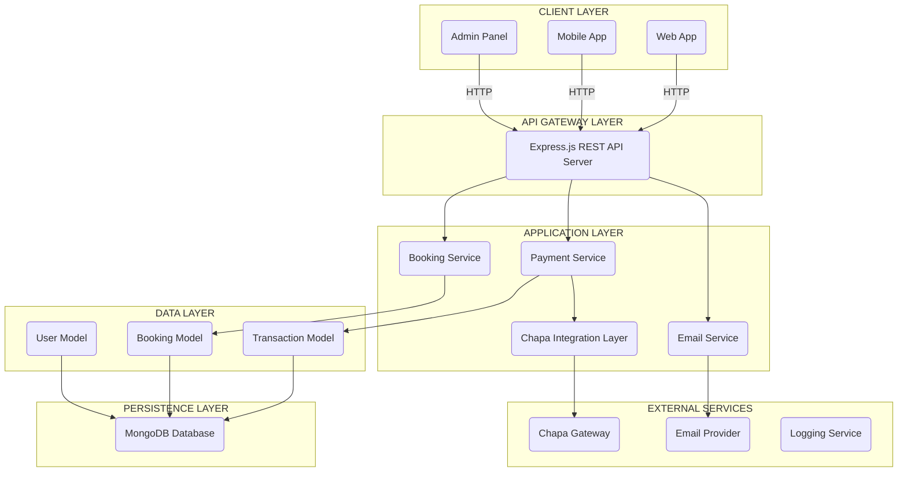
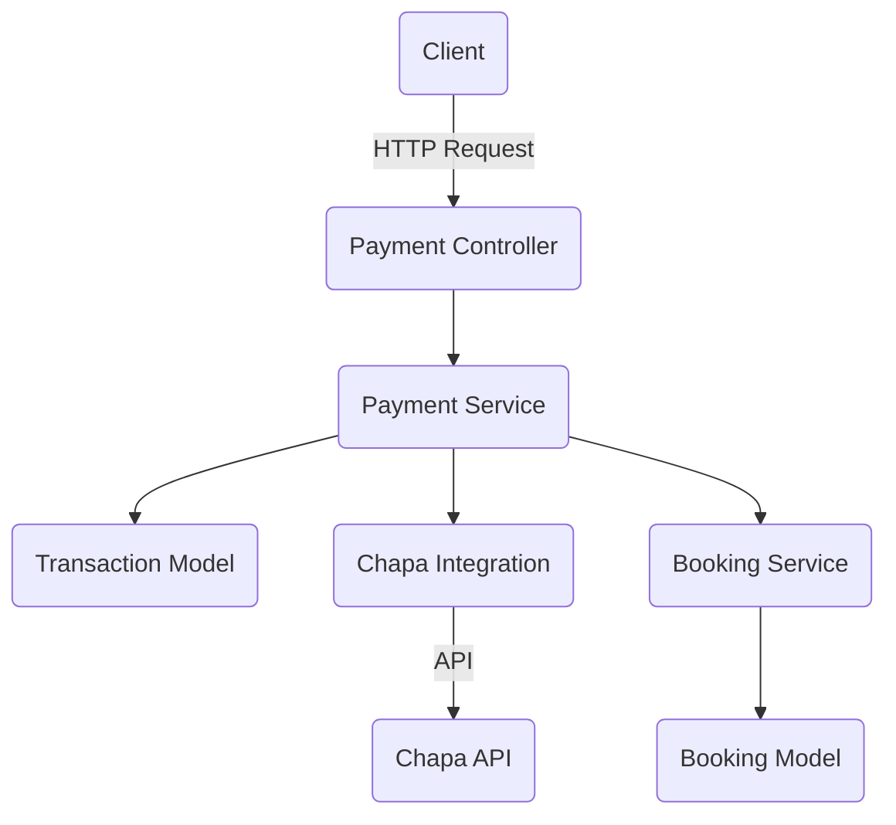
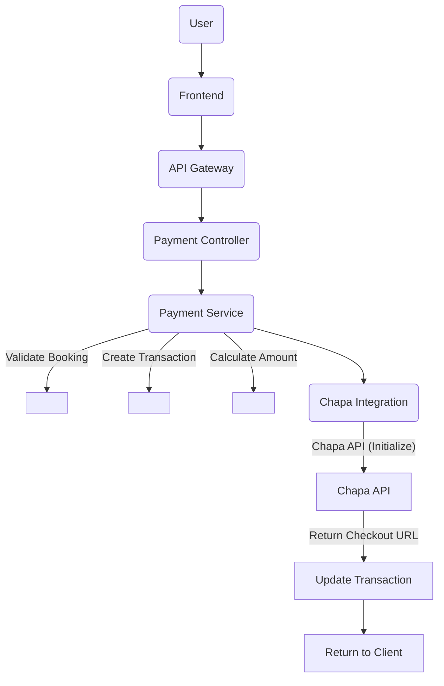
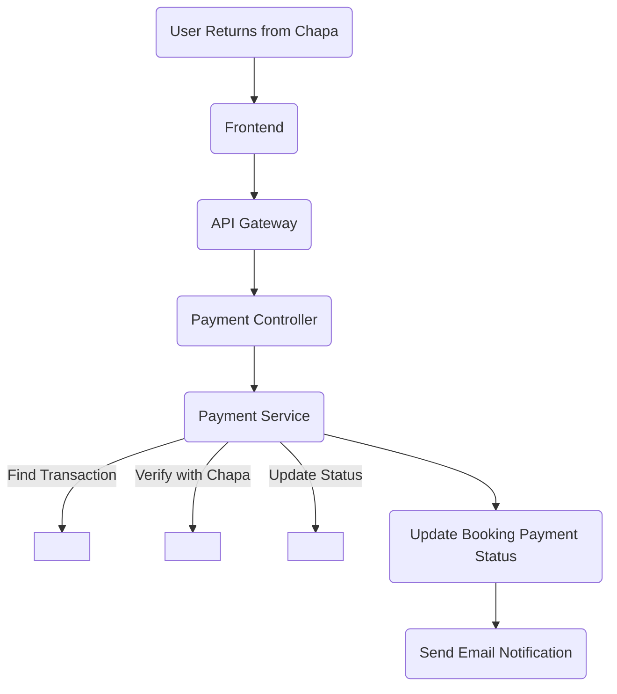
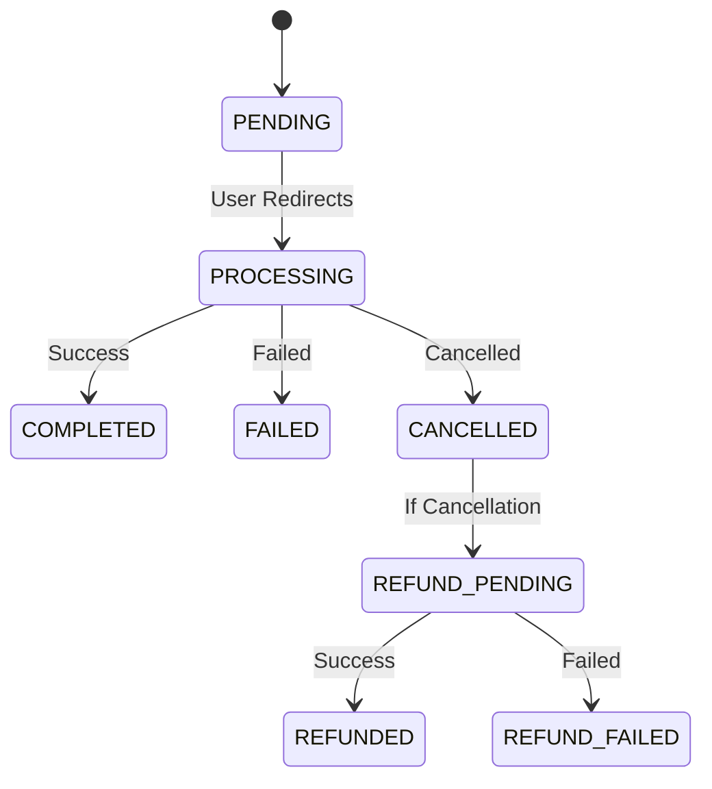
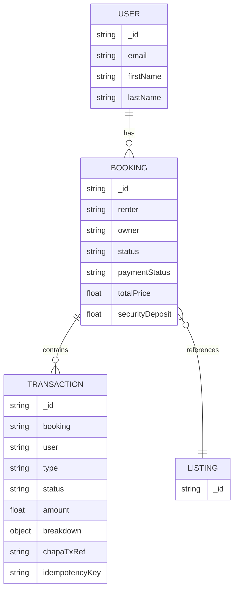
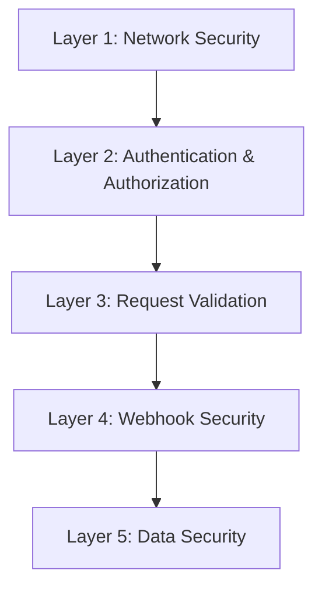
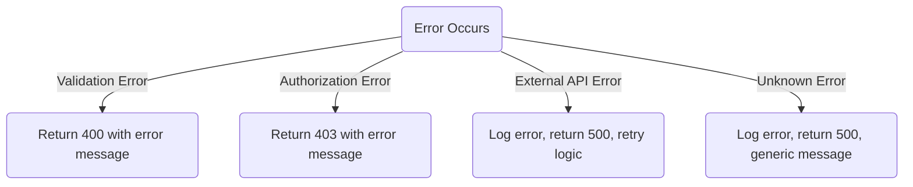

# Payment System Architecture - High-Level Design Document

## Document Information

**System**: Habesha Ride Car Rental Platform  
**Component**: Payment Gateway Integration  
**Provider**: Chapa (Ethiopian Payment Gateway)  
**Version**: 1.0  
**Date**: December 2024  
**Document Type**: High-Level Architecture

---

## Table of Contents

1. [Executive Summary](#1-executive-summary)
2. [System Architecture Overview](#2-system-architecture-overview)
3. [Component Architecture](#3-component-architecture)
4. [Payment Flow Architecture](#4-payment-flow-architecture)
5. [Data Architecture](#5-data-architecture)
6. [Security Architecture](#6-security-architecture)
7. [Integration Architecture](#7-integration-architecture)
8. [Error Handling & Resilience](#8-error-handling--resilience)
9. [Scalability & Performance](#9-scalability--performance)
10. [Monitoring & Observability](#10-monitoring--observability)

---

## 1. Executive Summary

### 1.1 Purpose

This document describes the high-level architecture of the payment processing system integrated into the Habesha Ride car rental platform. The system enables secure, automated payment processing for bookings through the Chapa payment gateway.

### 1.2 Key Architectural Decisions

- **Separate Transaction Model**: Payment transactions are stored independently from bookings, enabling full audit trails and support for multiple transaction types (payments, refunds, deposits)
- **Asynchronous Payment Flow**: Payment initialization is decoupled from booking confirmation, allowing flexible payment timing
- **Dual Verification Strategy**: Both synchronous (user-triggered) and asynchronous (webhook) payment verification for reliability
- **Idempotent Processing**: All payment operations are idempotent to handle retries and duplicate requests safely
- **Signature-Based Security**: Webhook requests are secured using HMAC-SHA256 signature verification

### 1.3 System Capabilities

- Payment initialization and checkout URL generation
- Real-time payment status verification
- Asynchronous webhook processing for payment updates
- Refund transaction management
- Complete transaction history and audit trails
- Automatic booking confirmation (for instant bookings)
- Email notifications for payment events

---

## 2. System Architecture Overview

### 2.1 High-Level System Diagram



### 2.2 Architectural Patterns

**Layered Architecture**: Clear separation between presentation, business logic, and data layers

**Service-Oriented**: Business logic encapsulated in service modules (Payment Service, Booking Service)

**Event-Driven**: Webhook-based asynchronous notifications for payment status updates

**Repository Pattern**: Data access abstracted through Mongoose models

**Middleware Pattern**: Cross-cutting concerns (auth, validation, error handling) handled via middleware

---

## 3. Component Architecture

### 3.1 Core Components

#### 3.1.1 Payment Service

**Responsibility**: Orchestrates all payment-related business logic

**Key Functions**:

- Payment initialization workflow
- Payment verification logic
- Webhook processing and idempotency
- Refund transaction creation
- Booking status synchronization

**Dependencies**: Transaction Model, Booking Service, Chapa Integration, Email Service

#### 3.1.2 Chapa Integration Layer

**Responsibility**: Abstracts Chapa API interactions

**Key Functions**:

- Payment initialization API calls
- Payment verification API calls
- Webhook signature verification
- Transaction reference generation
- Idempotency key generation

**Dependencies**: Chapa REST API, Configuration Service

#### 3.1.3 Transaction Model

**Responsibility**: Data persistence for all payment transactions

**Key Features**:

- Transaction lifecycle tracking
- Financial breakdown snapshots
- Webhook payload storage
- Idempotency key management
- Audit trail maintenance

#### 3.1.4 Payment Controller

**Responsibility**: HTTP request handling and response formatting

**Key Functions**:

- Request validation
- Authentication enforcement
- Response serialization
- Error response formatting

#### 3.1.5 Webhook Handler

**Responsibility**: Secure processing of asynchronous payment notifications

**Key Features**:

- Signature verification (HMAC-SHA256)
- Raw body preservation for signature validation
- Idempotent processing
- Error resilience (always returns 200 to prevent retries)

### 3.2 Component Interaction Diagram



---

## 4. Payment Flow Architecture

### 4.1 Payment Initialization Flow



### 4.2 Payment Verification Flow

**Synchronous Verification (User-Triggered):**



**Asynchronous Verification (Webhook):**

```mermaid
flowchart TD
  W1(Chapa Gateway) --> W2(Webhook Endpoint [Raw Body])
  W2 --> W3(Signature Verification)
  W3 --> W4(Parse Payload)
  W4 --> W5(Payment Service [Process Webhook])
  W5 --> W6(Idempotency Check)
  W6 --> W7(Update Transaction)
  W7 --> W8(Update Booking)
  W8 --> W9(Send Notification)
  W9 --> W10(Return 200 OK)
```

### 4.3 Payment State Machine



### 4.4 Booking-Payment Synchronization

**State Synchronization Rules**:

| Booking Status | Payment Status | Payment Allowed | Action After Payment                                                                               |
| -------------- | -------------- | --------------- | -------------------------------------------------------------------------------------------------- |
| `pending`      | `pending`      | ❌ No           | Payment cannot be initiated. Must wait for owner approval.                                         |
| `confirmed`    | `pending`      | ✅ Yes          | Update `paymentStatus` to `paid`                                                                   |
| `active`       | `paid`         | ❌ No           | No action (already in progress)                                                                    |
| `cancelled`    | `paid`         | ❌ No           | Create refund transaction                                                                          |

**Note**: Payment can only be initialized for bookings with status `confirmed`. For instant bookings, the booking is created as `confirmed` immediately. For non-instant bookings, the owner must approve (change status from `pending` to `confirmed`) before payment can be initiated.

---

## 5. Data Architecture

### 5.1 Data Model Relationships



### 5.2 Transaction Data Structure

**Core Fields**:

- **Identity**: `_id`, `booking`, `user`, `chapaTxRef`
- **Financial**: `amount`, `currency`, `breakdown` (snapshot)
- **Status**: `type`, `status`, `provider`
- **Metadata**: `chapaTransactionId`, `chapaPaymentMethod`, `chapaResponse`
- **Webhook**: `webhookReceived`, `webhookPayload`, `webhookReceivedAt`
- **Idempotency**: `idempotencyKey`
- **Timestamps**: `initiatedAt`, `completedAt`, `failedAt`, `createdAt`, `updatedAt`

**Financial Breakdown Snapshot**:

- `rentalFee`: Base rental cost minus discounts
- `securityDeposit`: Security deposit amount
- `serviceFee`: Platform commission (5%)
- `deliveryFee`: Optional delivery charge
- `discountAmount`: Applied discounts

**Why Snapshot?**: Preserves historical financial data even if booking pricing logic changes, enabling accurate accounting and owner payout calculations.

### 5.3 Data Flow Patterns

**Write Pattern**:

- Transaction creation → MongoDB write → Chapa API call → Transaction update
- Webhook → Signature verification → Transaction update → Booking update

**Read Pattern**:

- Query by `booking` → Get all transactions for booking
- Query by `chapaTxRef` → Find transaction for verification
- Query by `idempotencyKey` → Check for duplicate processing

**Index Strategy**:

- `booking + type`: Fast lookup of payment/refund transactions
- `chapaTxRef`: Unique index for verification lookups
- `idempotencyKey`: Unique index for duplicate prevention
- `user + status`: User transaction history queries

---

## 6. Security Architecture

### 6.1 Security Layers



- **Layer 1 - Network Security**: HTTPS/TLS encryption, CORS, Rate limiting
- **Layer 2 - Authentication & Authorization**: JWT validation, Ownership verification, Role-based access
- **Layer 3 - Request Validation**: Input schema (Zod), business logic, NoSQL injection prevention
- **Layer 4 - Webhook Security**: HMAC-SHA256 signature, raw body
- **Layer 5 - Data Security**: Env vars, log redaction, secure storage

### 6.2 Webhook Security Architecture

**Signature Verification Flow**:

```mermaid
flowchart TD
  SG1(Chapa Gateway) -->|POST /webhook\nHeaders: Chapa-Signature| SG2(Express Server)
  SG2 -->|express.raw (preserves raw body)| SG3(Webhook Handler)
  SG3 -->|Extract signature & raw body| SG4(Signature Verification)
  SG4 -->|HMAC-SHA256(rawBody, webhookSecret)\nConstant-time compare| SG5{"Valid Signature?"}
  SG5 -- Yes --> SG6(Process Webhook)
  SG5 -- No --> SG7(Reject: return 200, log error)
```

**Critical Implementation Detail**: Webhook route must be defined BEFORE `express.json()` middleware to preserve raw body buffer for signature verification.

### 6.3 Idempotency Strategy

**Purpose**: Prevent duplicate processing of webhooks and payment operations

**Mechanism**:

- Unique `idempotencyKey` generated for each operation
- Database unique index on `idempotencyKey`
- Atomic update operations with conditional checks
- Idempotency key includes: operation type + identifiers + timestamp

**Idempotency Key Formats**:

- Payment: `payment-{bookingId}-{timestamp}`
- Webhook: `webhook-{tx_ref}-{event}-{timestamp}`
- Refund: `refund-{bookingId}-{timestamp}`

### 6.4 Authorization Model

**Access Control Matrix**:

| Endpoint           | User (Renter)        | User (Owner)     | Admin | Public                  |
| ------------------ | -------------------- | ---------------- | ----- | ----------------------- |
| Initialize Payment | ✅ (own booking)     | ❌               | ✅    | ❌                      |
| Verify Payment     | ✅ (own transaction) | ❌               | ✅    | ❌                      |
| Get Transactions   | ✅ (own booking)     | ✅ (own booking) | ✅    | ❌                      |
| Process Refund     | ❌                   | ❌               | ✅    | ❌                      |
| Webhook            | ❌                   | ❌               | ❌    | ✅ (signature verified) |

---

## 7. Integration Architecture

### 7.1 Chapa Gateway Integration

**Integration Points**:

1. **Payment Initialization**
   - Endpoint: `POST /transaction/initialize`
   - Authentication: Bearer token (Secret Key)
   - Response: Checkout URL

2. **Payment Verification**
   - Endpoint: `GET /transaction/verify/:tx_ref`
   - Authentication: Bearer token (Secret Key)
   - Response: Payment status and details

3. **Webhook Notifications**
   - Endpoint: `POST /api/v1/payments/webhook` (our endpoint)
   - Authentication: HMAC signature
   - Events: `charge.success`, `charge.failed`, `charge.cancelled`

**Integration Pattern**: RESTful API with synchronous calls for initialization/verification, asynchronous webhooks for status updates

### 7.2 Email Service Integration

**Integration Points**:

- Payment confirmation emails
- Payment failed notifications
- Refund initiated notifications
- Refund completed notifications
- Admin refund alerts

**Integration Pattern**: Fire-and-forget with error logging (email failures don't block payment processing)

### 7.3 Booking Service Integration

**Integration Points**:

- Payment status updates trigger booking status changes
- Booking cancellation triggers refund transaction creation
- Booking confirmation logic (auto-confirm for instant bookings)

**Integration Pattern**: Service-to-service calls within the same application layer

### 7.4 External Service Dependencies

```mermaid
flowchart TD
  E1[Habesha Ride Backend]
  E1 -- API --> E2[Chapa API]
  E1 -- SMTP/REST --> E3[Email Service (Brevo/Mailtrap)]
```

**Dependency Management**:

- Chapa API: Critical (payment processing fails if unavailable)
- Email Service: Non-critical (failures logged, don't block payment flow)

---

## 8. Error Handling & Resilience

### 8.1 Error Categories

**1. Validation Errors** (400)

- Invalid booking ID
- Booking already paid
- Unauthorized access
- Invalid transaction reference

**2. External Service Errors** (500)

- Chapa API timeout
- Chapa API rate limiting
- Network connectivity issues

**3. Business Logic Errors** (400/403)

- Booking status incompatible with payment
- Refund amount exceeds payment amount
- Transaction already processed

**4. Security Errors** (403)

- Invalid webhook signature
- Unauthorized transaction access

### 8.2 Error Handling Strategy

**Error Flow**:



**Resilience Patterns**:

1. **Retry Logic**: Chapa API calls include timeout and retry mechanisms
2. **Graceful Degradation**: Email failures don't block payment processing
3. **Idempotency**: Duplicate requests handled safely
4. **Webhook Resilience**: Always return 200 to prevent Chapa retries (errors logged internally)

### 8.3 Failure Scenarios & Mitigation

| Scenario                  | Impact                       | Mitigation                                              |
| ------------------------- | ---------------------------- | ------------------------------------------------------- |
| Chapa API down            | Payment initialization fails | Retry logic, user notification, manual fallback         |
| Webhook not received      | Payment status not updated   | Manual verification endpoint available                  |
| Database connection lost  | Transaction creation fails   | Retry with exponential backoff                          |
| Invalid webhook signature | Webhook rejected             | Logged for investigation, manual verification available |
| Duplicate webhook         | Potential double processing  | Idempotency keys prevent duplicates                     |

---

## 9. Scalability & Performance

### 9.1 Scalability Considerations

**Horizontal Scaling**:

- Stateless API design (no session storage)
- Database connection pooling
- Stateless webhook processing

**Vertical Scaling**:

- Efficient database queries with proper indexing
- Connection pooling for external APIs
- Async processing for non-critical operations (emails)

### 9.2 Performance Optimizations

**Database**:

- Indexed queries (`booking`, `chapaTxRef`, `idempotencyKey`)
- Compound indexes for common query patterns
- Selective field projection (exclude large payloads when not needed)

**API Calls**:

- Timeout configuration (30 seconds for Chapa API)
- Connection reuse (HTTP keep-alive)
- Async email sending (non-blocking)

**Caching Strategy**:

- Transaction verification results cached (if already verified)
- Booking data cached during payment flow

### 9.3 Load Handling

**Expected Load**:

- Payment initialization: ~100 requests/minute (peak)
- Webhook processing: ~50 webhooks/minute (peak)
- Verification requests: ~200 requests/minute (peak)

**Capacity Planning**:

- Database: MongoDB Atlas with auto-scaling
- API Server: Stateless, can scale horizontally
- External APIs: Chapa rate limits (monitor and handle gracefully)

---

## 10. Monitoring & Observability

### 10.1 Key Metrics

**Business Metrics**:

- Payment success rate
- Average payment completion time
- Refund processing time
- Transaction volume (daily/weekly/monthly)

**Technical Metrics**:

- API response times
- Chapa API call success rate
- Webhook delivery rate
- Database query performance
- Error rates by type

### 10.2 Logging Strategy

**Log Levels**:

- **INFO**: Successful operations (payment initialized, verified, webhook processed)
- **WARN**: Non-critical issues (duplicate webhook, expired transaction)
- **ERROR**: Critical failures (Chapa API errors, signature verification failures)
- **DEBUG**: Detailed request/response data (development only)

**Logged Events**:

- Payment initialization (bookingId, amount, tx_ref)
- Payment verification (tx_ref, status, userId)
- Webhook processing (tx_ref, event, signature verification result)
- Refund creation (bookingId, amount, reason)
- Error occurrences (error type, context, stack trace)

### 10.3 Alerting Strategy

**Critical Alerts**:

- Payment success rate drops below 80%
- Chapa API error rate exceeds 5%
- Webhook signature verification failures spike
- Database connection failures

**Warning Alerts**:

- Average payment time exceeds 2 minutes
- Webhook delivery delay exceeds 5 minutes
- High number of duplicate webhook attempts

### 10.4 Observability Tools

**Recommended Stack**:

- **Logging**: Pino (structured JSON logging)
- **Monitoring**: Application Performance Monitoring (APM) tool
- **Error Tracking**: Sentry or similar
- **Metrics**: Custom dashboard or monitoring service

---

## 11. Deployment Architecture

### 11.1 Environment Configuration

**Development**:

- Local MongoDB or MongoDB Atlas (dev cluster)
- Chapa test keys
- Local webhook testing (ngrok)

**Staging**:

- MongoDB Atlas (staging cluster)
- Chapa test keys
- Staging webhook URL configured in Chapa

**Production**:

- MongoDB Atlas (production cluster)
- Chapa production keys
- Production webhook URL configured in Chapa
- SSL/TLS certificates
- CDN for static assets (if applicable)

### 11.2 Configuration Management

**Environment Variables**:

- Chapa credentials (secret key, webhook secret)
- Database connection strings
- Application URLs (BASE_URL, CLIENT_URL)
- Email service credentials

**Security**:

- Secrets stored in environment variables (never in code)
- Production secrets rotated regularly
- Webhook secret matches Chapa dashboard configuration

---

## 12. Future Enhancements

### 12.1 Planned Features

- **Partial Refunds**: Support for partial refunds based on cancellation policies
- **Payment Methods**: Support for multiple payment providers (not just Chapa)
- **Subscription Payments**: Recurring payment support for long-term rentals
- **Payment Plans**: Installment payment options
- **Security Deposit Holds**: Pre-authorization for security deposits (when Chapa supports it)

### 12.2 Technical Improvements

- **Background Jobs**: Automated transaction expiration cleanup
- **Payment Analytics**: Advanced reporting and analytics dashboard
- **Webhook Retry Logic**: Automatic retry for failed webhook processing
- **Payment Reconciliation**: Automated daily reconciliation with Chapa

---

## Appendix A: Glossary

- **tx_ref**: Transaction reference - unique identifier for Chapa transactions
- **Idempotency Key**: Unique key to prevent duplicate processing of operations
- **Webhook**: Asynchronous HTTP callback from Chapa to notify payment status changes
- **Checkout URL**: Chapa-hosted payment page URL
- **Financial Breakdown**: Snapshot of payment components (rental fee, deposit, service fee, etc.)

## Appendix B: References

- Chapa API Documentation: https://developer.chapa.co/
- Payment Implementation Plan: `PAYMENT_IMPLEMENTATION_PLAN.md`
- System Architecture: Habesha Ride Backend v2.0

---

**Document Status**: ✅ Complete  
**Last Updated**: December 2024  
**Next Review**: Q1 2025
