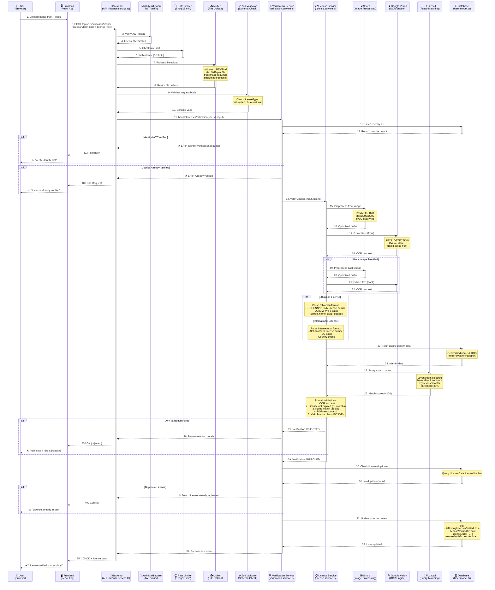

# Habesha Ride Backend v2 - Driver's License Verification Flow

## Hybrid Intelligence Architecture Documentation

This document provides a comprehensive sequence diagram and detailed explanation of the Driver's License Verification flow in the Habesha Ride application. This implementation enables verified users (via Fayda or Passport) to complete their legal compliance requirements by verifying their driver's license through Google Cloud Vision OCR and fuzzy name matching.

---

## Driver's License Verification Sequence Diagram



---

## Detailed Step-by-Step Flow

### **Phase 1: Request Initiation**

**Steps 1-2: User Upload**

- User uploads license images (front required, back optional)
- Frontend selects `licenseType`: `'ethiopian'` or `'international'`
- Sends `multipart/form-data` request to `POST /api/v1/verification/license`

**Request Format:**

```http
POST /api/v1/verification/license
Authorization: Bearer <jwt_token>
Content-Type: multipart/form-data

frontImage: [File]
backImage: [File] (optional)
licenseType: "ethiopian" | "international"
```

---

### **Phase 2: Security & Validation Middleware**

**Steps 3-4: JWT Authentication**

- `auth.middleware.ts` validates JWT token
- Extracts user ID from token payload
- Ensures user is logged in

**Steps 5-6: Rate Limiting**

- `licenseVerificationLimiter` checks request count
- **Limit:** 5 attempts per 15 minutes per IP
- Prevents abuse and excessive OCR costs

**Steps 7-8: File Upload Processing**

- `uploadLicenseImages` Multer middleware processes files
- **Validations:**
  - File types: JPEG, PNG only
  - Max size: 5MB per file (configurable via `LICENSE_MAX_FILE_SIZE`)
  - `frontImage` is required
  - `backImage` is optional
- Stores files in memory as buffers

**Steps 9-10: Schema Validation**

- Zod schema validates `licenseType` field
- Must be exactly `'ethiopian'` or `'international'`
- Returns clear error if invalid

---

### **Phase 3: Verification Service Orchestration**

**Steps 11-13: User Document Retrieval**

- `verification.service.ts` fetches user from database
- Checks if user exists

**Prerequisite Checks:**

1. **Identity Verification Required**

   ```typescript
   if (!user.isIdentityVerified) {
     throw new AppError(
       'Please verify your identity (Fayda or Passport) before verifying your license.',
       403,
     );
   }
   ```

   - User MUST complete Fayda OR Passport verification first
   - Ensures we have verified name and DOB to match against

2. **Already Verified Check**
   ```typescript
   if (user.isDrivingLicenseVerified) {
     throw new AppError('Your driving license is already verified.', 400);
   }
   ```

   - Prevents duplicate license verification attempts

---

### **Phase 4: License Service - OCR Processing**

**Steps 14-16: Image Preprocessing (Front)**

- `license.service.ts` receives file buffers
- Uses Sharp to optimize images:
  ```typescript
  // If image > 4MB, resize
  if (buffer.length > 4 * 1024 * 1024) {
    buffer = await sharp(buffer)
      .resize(2000, 2000, { fit: 'inside' })
      .jpeg({ quality: 85 })
      .toBuffer();
  }
  ```
- Reduces OCR costs while maintaining accuracy

**Steps 17-18: Google Vision OCR (Front)**

- Sends optimized buffer to Google Cloud Vision API
- Uses `TEXT_DETECTION` feature
- Extracts all text from license front image
- Returns raw OCR text with bounding boxes

**Steps 19-22: Back Image Processing (Optional)**

- If `backImage` provided, repeat preprocessing and OCR
- Some licenses (e.g., international) have important data on back
- Ethiopian licenses may have additional info on back

---

### **Phase 5: License Data Parsing**

**Ethiopian License Format:**

```typescript
// Example extracted data:
{
  licenseNumber: "ET-AA-1234567",  // Format: ET-[Region]-[Number]
  fullName: "ABEBE KEBEDE",
  birthdate: "1990-05-15",         // Parsed from DD/MM/YYYY
  expiryDate: "2028-05-15",
  issueDate: "2023-05-15",
  licenseClass: ["B", "C"],        // Multiple classes possible
  bloodType: "A+",
  nationality: "ETH",
  countryOfIssue: "ETH"
}
```

**International License Format:**

```typescript
// Example extracted data:
{
  licenseNumber: "US-CA-D1234567",
  fullName: "JOHN DOE",
  birthdate: "1985-08-20",         // ISO format
  expiryDate: "2030-08-20",
  licenseClass: ["B", "D"],
  nationality: "USA",
  countryOfIssue: "USA",
  isInternationalLicense: true
}
```

**Parsing Logic:**

- Regex patterns for license numbers
- Date format detection (DD/MM/YYYY vs ISO)
- Name extraction (uppercase normalization)
- License class extraction (B, C, D, E)
- Blood type parsing (Ethiopian only)
- Nationality/country codes

---

### **Phase 6: Identity Data Matching**

**Steps 23-24: Fetch Verified Identity**

```typescript
const identityData = user.isIdentityVerified
  ? user.identityVerificationMethod === 'fayda'
    ? { fullName: user.faydaData.fullName, birthdate: user.faydaData.birthdate }
    : {
        fullName: user.passportData.fullName,
        birthdate: user.passportData.birthdate,
      }
  : null;
```

---

### **Phase 7: Fuzzy Name Matching**

**Steps 25-26: Levenshtein Distance Matching**

Why fuzzy matching?

- OCR may misread characters (e.g., "O" vs "0", "I" vs "l")
- Name order variations (First Last vs Last First)
- Middle name presence/absence
- Spacing differences

**Algorithm:**

```typescript
import { ratio } from 'fuzzball';

function fuzzyMatchName(
  licenseName: string,
  identityName: string,
): {
  match: boolean;
  score: number;
} {
  // Normalize names
  const name1 = licenseName.trim().toUpperCase().replace(/\s+/g, ' ');
  const name2 = identityName.trim().toUpperCase().replace(/\s+/g, ' ');

  // Calculate similarity score
  const score = ratio(name1, name2);

  // Try reversed order (Last First vs First Last)
  const reversed = name2.split(' ').reverse().join(' ');
  const reversedScore = ratio(name1, reversed);

  const finalScore = Math.max(score, reversedScore);

  // Threshold: 85% (configurable via LICENSE_NAME_MATCH_THRESHOLD)
  return {
    match: finalScore >= 85,
    score: finalScore,
  };
}
```

**Example Matches:**

- "ABEBE KEBEDE" vs "ABEBE KEBEDE" → 100% ✅
- "ABEBE KEBEDE" vs "KEBEDE ABEBE" → 100% ✅ (reversed)
- "ABEBE KEBEDE" vs "ABEBE K3BEDE" → ~93% ✅ (OCR error)
- "JOHN DOE" vs "JANE SMITH" → 30% ❌

---

### **Phase 8: Comprehensive Validations**

**1. OCR Success**

```typescript
ocrSuccess: !!parsedLicenseData.licenseNumber;
```

- Ensures license number was extracted

**2. License Not Expired**

```typescript
function validateLicenseExpiry(
  expiryDate: string,
  minValidityMonths: number,
): boolean {
  const expiry = new Date(expiryDate);
  const now = new Date();
  const monthsRemaining =
    (expiry.getTime() - now.getTime()) / (1000 * 60 * 60 * 24 * 30);
  return monthsRemaining >= minValidityMonths; // Default: 3 months
}
```

- License must be valid for at least 3 more months (configurable)
- Prevents booking with soon-to-expire licenses

**3. Name Match**

```typescript
nameMatch: matchingResult.nameMatch; // >= 85% similarity
```

**4. DOB Exact Match**

```typescript
function matchDOB(licenseDOB: string, identityDOB: string): boolean {
  return (
    new Date(licenseDOB).toISOString().split('T')[0] ===
    new Date(identityDOB).toISOString().split('T')[0]
  );
}
```

- Must be exact date match (no fuzzy logic for dates)

**5. Valid License Class**

```typescript
function validateLicenseClass(classes: string[]): boolean {
  const validClasses = ['B', 'C', 'D', 'E'];
  return (
    classes.length > 0 &&
    classes.every((c) => validClasses.includes(c.toUpperCase()))
  );
}
```

- Must have at least one valid class
- Valid for standard vehicle categories

**Approval Logic:**

```typescript
const approved =
  validations.ocrSuccess &&
  validations.notExpired &&
  validations.nameMatch &&
  validations.dobMatch &&
  validations.licenseClassValid;
```

- ALL validations must pass for approval

---

### **Phase 9: Rejection Handling**

If any validation fails:

```json
{
  "status": "rejected",
  "data": {
    "success": false,
    "approved": false,
    "reason": "Name from license does not match verified identity (similarity: 42%)",
    "validations": {
      "ocrSuccess": true,
      "notExpired": true,
      "nameMatch": false,
      "dobMatch": true,
      "licenseClassValid": true
    },
    "matchingResult": {
      "nameMatch": false,
      "nameMatchScore": 42,
      "dobMatch": true,
      "identitySource": "fayda"
    }
  }
}
```

**Common Rejection Reasons:**

1. "Could not extract license number from the image"
2. "License has expired or will expire within 3 months"
3. "Name from license does not match verified identity (similarity: X%)"
4. "Date of birth from license does not match verified identity"
5. "License class is not valid for car bookings"

---

### **Phase 10: Duplicate Prevention**

**Steps 30-31: Duplicate License Check**

```typescript
const licenseExists = await User.findOne({
  'licenseData.licenseNumber': licenseNumber,
  _id: { $ne: userId },
});
```

- Queries database for existing license number
- Uses indexed field for fast lookup
- Prevents one license being used by multiple users
- Returns `409 Conflict` if duplicate found

---

### **Phase 11: Database Update**

**Steps 32-33: User Document Update**

```typescript
user.isDrivingLicenseVerified = true;
user.licenseVerifiedAt = new Date();
user.licenseData = {
  licenseNumber: parsedLicenseData.licenseNumber,
  fullName: parsedLicenseData.fullName,
  birthdate: parsedLicenseData.birthdate,
  expiryDate: parsedLicenseData.expiryDate,
  issueDate: parsedLicenseData.issueDate,
  licenseClass: parsedLicenseData.licenseClass,
  bloodType: parsedLicenseData.bloodType,
  nationality: parsedLicenseData.nationality,
  isInternationalLicense: parsedLicenseData.isInternationalLicense,
  countryOfIssue: parsedLicenseData.countryOfIssue,
  nameMatchScore: matchingResult.nameMatchScore,
  dobMatch: matchingResult.dobMatch,
  ocrRawFront: parsedLicenseData.ocrRawFront,
  ocrRawBack: parsedLicenseData.ocrRawBack,
  verifiedAt: new Date(),
};

await user.save();
```

**Indexes Created:**

```typescript
userSchema.index(
  { 'licenseData.licenseNumber': 1 },
  { unique: true, sparse: true },
);
userSchema.index({ isDrivingLicenseVerified: 1 });
userSchema.index({ licenseVerifiedAt: 1 });
```

---

### **Phase 12: Success Response**

**Steps 34-35: Return Success**

```json
{
  "status": "success",
  "data": {
    "success": true,
    "approved": true,
    "message": "License verified successfully",
    "user": {
      "id": "67890abcdef",
      "isIdentityVerified": true,
      "identityVerificationMethod": "fayda",
      "identityVerifiedAt": "2025-12-20T10:00:00.000Z",
      "isDrivingLicenseVerified": true,
      "licenseVerifiedAt": "2025-12-25T14:30:00.000Z",
      "licenseData": {
        "licenseNumber": "ET-AA-1234567",
        "fullName": "ABEBE KEBEDE",
        "birthdate": "1990-05-15",
        "expiryDate": "2028-05-15",
        "issueDate": "2023-05-15",
        "licenseClass": ["B", "C"],
        "bloodType": "A+",
        "nationality": "ETH",
        "isInternationalLicense": false,
        "countryOfIssue": "ETH",
        "nameMatchScore": 95.5,
        "dobMatch": true,
        "verifiedAt": "2025-12-25T14:30:00.000Z"
      }
    },
    "validations": {
      "ocrSuccess": true,
      "notExpired": true,
      "nameMatch": true,
      "dobMatch": true,
      "licenseClassValid": true
    },
    "matchingResult": {
      "nameMatch": true,
      "nameMatchScore": 95.5,
      "dobMatch": true,
      "identitySource": "fayda"
    }
  }
}
```

---

## Architecture Highlights

### **1. Hybrid Intelligence Design**

```
Google Cloud Vision (OCR)
    ↓
Text Parsing & Extraction
    ↓
Fuzzball Fuzzy Matching (Levenshtein)
    ↓
Business Logic Validation
    ↓
MongoDB Storage
```

**Why Google Vision for OCR?**

- Best-in-class text detection accuracy
- Multi-language support (Amharic, English, Arabic)
- Handles rotated/skewed images
- Cost-effective for text extraction

**Why Fuzzball for Matching?**

- Handles OCR errors gracefully
- Levenshtein distance algorithm (proven)
- Configurable threshold
- No external API calls (cost-free)

---

### **2. Service Layer Architecture**

**`license.service.ts` (Pure Business Logic)**

```typescript
// Public API
export const verifyLicense: (input, userId) => Promise<Result>;

// Internal helpers (not exported)
function preprocessImage(buffer): Promise<Buffer>;
function extractLicenseText(buffer): Promise<string>;
function parseEthiopianLicense(text): ParsedData;
function parseInternationalLicense(text): ParsedData;
function fuzzyMatchName(name1, name2, threshold): { match; score };
function matchDOB(dob1, dob2): boolean;
function validateLicenseExpiry(date, months): boolean;
function validateLicenseClass(classes): boolean;
```

**`verification.service.ts` (Orchestration Layer)**

```typescript
export const handleLicenseVerification: (userId, input) => Promise<Response>;
// - Prerequisite checks (identity verified)
// - Duplicate prevention
// - Database updates
// - Response formatting
```

---

### **3. Rate Limiting Strategy**

**License Verification Limiter:**

```typescript
export const licenseVerificationLimiter = rateLimit({
  windowMs: 15 * 60 * 1000, // 15 minutes
  max: 5, // 5 attempts per window
  message: 'Too many license verification attempts. Please try again later.',
  standardHeaders: true,
  legacyHeaders: false,
});
```

**Rationale:**

- OCR is expensive (Google Vision API costs)
- Prevents abuse/spam
- Allows legitimate retries (bad photo quality)
- More lenient than Fayda (3 attempts) due to OCR variability

---

### **4. Error Handling**

**15 Error Scenarios Handled:**

| Error Code | Scenario              | Message                                                                                 |
| ---------- | --------------------- | --------------------------------------------------------------------------------------- |
| 401        | No auth token         | "Authentication required"                                                               |
| 401        | Invalid token         | "Invalid or expired token"                                                              |
| 403        | Identity not verified | "Please verify your identity (Fayda or Passport) before verifying your license."        |
| 400        | Already verified      | "Your driving license is already verified."                                             |
| 400        | No front image        | "Front image of license is required."                                                   |
| 400        | Invalid file type     | "Only JPEG and PNG images are allowed."                                                 |
| 413        | File too large        | "Image size exceeds 5MB limit."                                                         |
| 400        | Invalid license type  | "License type must be 'ethiopian' or 'international'"                                   |
| 500        | Google Vision error   | "Failed to process license image. Please try again."                                    |
| 200        | OCR failed            | "Could not extract license number from the image" (rejected)                            |
| 200        | Expired               | "License has expired or will expire within 3 months" (rejected)                         |
| 200        | Name mismatch         | "Name from license does not match verified identity (similarity: X%)" (rejected)        |
| 200        | DOB mismatch          | "Date of birth from license does not match verified identity" (rejected)                |
| 200        | Invalid class         | "License class is not valid for car bookings" (rejected)                                |
| 409        | Duplicate license     | "This license is already registered in our system. Each license can only be used once." |
| 429        | Rate limit            | "Too many license verification attempts. Please try again later."                       |

---

## Security Features

### **1. JWT Authentication**

- Every request requires valid JWT token
- Token contains user ID for authorization
- Short-lived tokens (configurable expiry)

### **2. Rate Limiting**

- 5 attempts per 15 minutes per IP
- Prevents brute force OCR attempts
- Reduces API costs

### **3. File Validation**

- Whitelist: JPEG, PNG only
- Max size: 5MB per file
- Stored in memory (not disk) for security
- Buffers cleared after processing

### **4. Duplicate Prevention**

- Unique index on `licenseData.licenseNumber`
- Database-level constraint
- Prevents one license across multiple accounts

### **5. Prerequisite Enforcement**

- Must complete identity verification first
- Ensures we have verified data to match against
- Creates audit trail (Fayda/Passport → License)

### **6. Input Validation**

- Zod schemas for type safety
- Enum validation for `licenseType`
- ObjectId validation for admin operations

### **7. Raw OCR Storage**

- Stores `ocrRawFront` and `ocrRawBack`
- Audit trail for disputes
- Manual review capability

---

## Configuration Requirements

### **Environment Variables**

```env
# Google Cloud Vision API
GOOGLE_CLOUD_PROJECT_ID=your-project-id
GOOGLE_APPLICATION_CREDENTIALS=path/to/service-account-key.json

# License Verification Settings
LICENSE_MAX_FILE_SIZE=5242880          # 5MB in bytes
LICENSE_NAME_MATCH_THRESHOLD=85        # Fuzzy match threshold (0-100)
LICENSE_MIN_VALIDITY_MONTHS=3          # Minimum months before expiry

# JWT Authentication
JWT_SECRET=your-secret-key
JWT_EXPIRES_IN=7d

# Database
MONGODB_URI=mongodb://localhost:27017/habesha-ride-backend
```

### **NPM Dependencies**

```json
{
  "dependencies": {
    "@google-cloud/vision": "^4.3.2",
    "sharp": "^0.33.5",
    "fuzzball": "^2.1.2",
    "express": "^4.18.2",
    "mongoose": "^8.0.3",
    "zod": "^3.22.4",
    "multer": "^1.4.5-lts.1",
    "express-rate-limit": "^7.1.5"
  },
  "devDependencies": {
    "@types/multer": "^1.4.11",
    "typescript": "^5.3.3"
  }
}
```

---

## Database Schema

### **User Model Updates**

```typescript
interface IUser extends Document {
  // ... existing fields ...

  // Driver's License Verification
  isDrivingLicenseVerified: boolean; // Default: false
  licenseVerifiedAt?: Date;
  licenseData?: {
    licenseNumber: string; // Unique, indexed
    fullName: string;
    birthdate: string; // YYYY-MM-DD
    expiryDate: string;
    issueDate?: string;
    licenseClass: string[]; // ['B', 'C', etc.]
    bloodType?: string; // Ethiopian licenses
    nationality: string; // Country code
    isInternationalLicense: boolean;
    countryOfIssue: string;
    licenseImageUrl?: string; // S3 URL (future)
    licenseBackImageUrl?: string; // S3 URL (future)
    verifiedAt: Date;
    nameMatchScore?: number; // 0-100
    dobMatch: boolean;
    ocrRawFront: string; // Raw OCR for audit
    ocrRawBack?: string;
  };
}
```

### **Indexes**

```typescript
// Unique license number (sparse: allows null)
userSchema.index(
  { 'licenseData.licenseNumber': 1 },
  { unique: true, sparse: true },
);

// Query by verification status
userSchema.index({ isDrivingLicenseVerified: 1 });

// Query by verification date
userSchema.index({ licenseVerifiedAt: 1 });
```

---

## API Endpoints

### **1. Verify Driver's License**

```http
POST /api/v1/verification/license
Authorization: Bearer <jwt_token>
Content-Type: multipart/form-data

frontImage: [File]
backImage: [File] (optional)
licenseType: "ethiopian" | "international"
```

**Success Response (200 OK):**

```json
{
  "status": "success",
  "data": {
    "success": true,
    "approved": true,
    "message": "License verified successfully",
    "user": {
      /* ... user data ... */
    },
    "validations": {
      /* ... validation results ... */
    },
    "matchingResult": {
      /* ... matching details ... */
    }
  }
}
```

**Rejection Response (200 OK):**

```json
{
  "status": "rejected",
  "data": {
    "success": false,
    "approved": false,
    "reason": "Name from license does not match verified identity (similarity: 42%)",
    "validations": {
      /* ... validation results ... */
    },
    "matchingResult": {
      /* ... matching details ... */
    }
  }
}
```

---

### **2. Get Verification Status**

```http
GET /api/v1/verification/status?includeLicense=true
Authorization: Bearer <jwt_token>
```

**Response (200 OK):**

```json
{
  "status": "success",
  "data": {
    "userId": "67890abcdef",
    "isIdentityVerified": true,
    "identityVerificationMethod": "fayda",
    "identityVerifiedAt": "2025-12-20T10:00:00.000Z",
    "isDrivingLicenseVerified": true,
    "licenseVerifiedAt": "2025-12-25T14:30:00.000Z",
    "licenseData": {
      /* ... license details ... */
    }
  }
}
```

---

### **3. Revoke License Verification (Admin Only)**

```http
DELETE /api/v1/verification/license/:userId
Authorization: Bearer <admin_jwt_token>
```

**Response (200 OK):**

```json
{
  "status": "success",
  "message": "All verifications revoked for user 67890abcdef"
}
```

**Notes:**

- Clears `isDrivingLicenseVerified`, `licenseVerifiedAt`, `licenseData`
- Also clears identity verification data (Fayda/Passport)
- Requires `admin` or `superadmin` role

---

## Frontend Integration Guide

### **Step 1: Check Prerequisites**

```typescript
// Check if identity is verified before showing license form
const { data: status } = await api.get('/verification/status');

if (!status.isIdentityVerified) {
  showAlert('Please verify your identity (Fayda or Passport) first');
  redirectTo('/verification/identity');
  return;
}

if (status.isDrivingLicenseVerified) {
  showAlert('Your license is already verified');
  redirectTo('/dashboard');
  return;
}

// Show license verification form
showLicenseVerificationForm();
```

---

### **Step 2: Upload License Images**

```typescript
import { useState } from 'react';

function LicenseVerification() {
  const [frontImage, setFrontImage] = useState<File | null>(null);
  const [backImage, setBackImage] = useState<File | null>(null);
  const [licenseType, setLicenseType] = useState<'ethiopian' | 'international'>('ethiopian');
  const [loading, setLoading] = useState(false);

  const handleSubmit = async (e: React.FormEvent) => {
    e.preventDefault();

    if (!frontImage) {
      alert('Front image is required');
      return;
    }

    const formData = new FormData();
    formData.append('frontImage', frontImage);
    if (backImage) formData.append('backImage', backImage);
    formData.append('licenseType', licenseType);

    setLoading(true);

    try {
      const response = await fetch('/api/v1/verification/license', {
        method: 'POST',
        headers: {
          'Authorization': `Bearer ${getToken()}`
        },
        body: formData
      });

      const result = await response.json();

      if (result.status === 'success' && result.data.approved) {
        showSuccess('License verified successfully!');
        redirectTo('/dashboard');
      } else if (result.status === 'rejected') {
        showError(`Verification failed: ${result.data.reason}`);

        // Show which validations failed
        const { validations } = result.data;
        if (!validations.nameMatch) {
          showHint('Ensure the name on your license matches your verified identity');
        }
        if (!validations.notExpired) {
          showHint('Your license must be valid for at least 3 more months');
        }
      }
    } catch (error) {
      showError('Failed to upload license. Please try again.');
    } finally {
      setLoading(false);
    }
  };

  return (
    <form onSubmit={handleSubmit}>
      {/* License Type Selection */}
      <div>
        <label>License Type:</label>
        <select value={licenseType} onChange={e => setLicenseType(e.target.value as any)}>
          <option value="ethiopian">Ethiopian License</option>
          <option value="international">International License/Permit</option>
        </select>
      </div>

      {/* Front Image Upload */}
      <div>
        <label>License Front Image (Required):</label>
        <input
          type="file"
          accept="image/jpeg,image/png"
          onChange={e => setFrontImage(e.target.files?.[0] || null)}
          required
        />
        <p>Max size: 5MB</p>
      </div>

      {/* Back Image Upload */}
      <div>
        <label>License Back Image (Optional):</label>
        <input
          type="file"
          accept="image/jpeg,image/png"
          onChange={e => setBackImage(e.target.files?.[0] || null)}
        />
      </div>

      <button type="submit" disabled={loading || !frontImage}>
        {loading ? 'Verifying...' : 'Verify License'}
      </button>
    </form>
  );
}
```

---

### **Step 3: Display Verification Status**

```typescript
function ProfilePage() {
  const { data: status } = useQuery('verificationStatus', () =>
    api.get('/verification/status?includeLicense=true')
  );

  return (
    <div>
      <h2>Verification Status</h2>

      {/* Identity Verification */}
      <div>
        <h3>Identity Verification</h3>
        <StatusBadge verified={status.isIdentityVerified} />
        {status.isIdentityVerified && (
          <p>Method: {status.identityVerificationMethod}</p>
        )}
      </div>

      {/* License Verification */}
      <div>
        <h3>Driver's License Verification</h3>
        <StatusBadge verified={status.isDrivingLicenseVerified} />
        {status.isDrivingLicenseVerified && (
          <div>
            <p>License Number: {status.licenseData.licenseNumber}</p>
            <p>Expiry: {formatDate(status.licenseData.expiryDate)}</p>
            <p>Classes: {status.licenseData.licenseClass.join(', ')}</p>
            <p>Name Match Score: {status.licenseData.nameMatchScore}%</p>
          </div>
        )}
      </div>
    </div>
  );
}
```

---

## Testing Guide

### **Unit Tests**

**Test Name Matching:**

```typescript
describe('fuzzyMatchName', () => {
  it('should match identical names', () => {
    const result = fuzzyMatchName('JOHN DOE', 'JOHN DOE', 85);
    expect(result.match).toBe(true);
    expect(result.score).toBe(100);
  });

  it('should match reversed names', () => {
    const result = fuzzyMatchName('JOHN DOE', 'DOE JOHN', 85);
    expect(result.match).toBe(true);
    expect(result.score).toBe(100);
  });

  it('should handle OCR errors', () => {
    const result = fuzzyMatchName('JOHN DOE', 'J0HN D0E', 85);
    expect(result.match).toBe(true);
    expect(result.score).toBeGreaterThan(85);
  });

  it('should reject completely different names', () => {
    const result = fuzzyMatchName('JOHN DOE', 'JANE SMITH', 85);
    expect(result.match).toBe(false);
    expect(result.score).toBeLessThan(50);
  });
});
```

**Test Date Validation:**

```typescript
describe('validateLicenseExpiry', () => {
  it('should accept license expiring in 6 months', () => {
    const expiry = new Date();
    expiry.setMonth(expiry.getMonth() + 6);
    expect(validateLicenseExpiry(expiry.toISOString(), 3)).toBe(true);
  });

  it('should reject license expiring in 2 months', () => {
    const expiry = new Date();
    expiry.setMonth(expiry.getMonth() + 2);
    expect(validateLicenseExpiry(expiry.toISOString(), 3)).toBe(false);
  });

  it('should reject expired license', () => {
    const expiry = new Date('2020-01-01');
    expect(validateLicenseExpiry(expiry.toISOString(), 3)).toBe(false);
  });
});
```

---

### **Integration Tests**

**Test End-to-End Flow:**

```typescript
describe('POST /api/v1/verification/license', () => {
  let authToken: string;
  let userId: string;

  beforeAll(async () => {
    // Create and verify user identity
    const user = await createTestUser();
    await verifyUserIdentity(user._id, 'fayda');
    authToken = generateToken(user._id);
    userId = user._id.toString();
  });

  it('should reject without identity verification', async () => {
    const unverifiedUser = await createTestUser();
    const token = generateToken(unverifiedUser._id);

    const response = await request(app)
      .post('/api/v1/verification/license')
      .set('Authorization', `Bearer ${token}`)
      .attach('frontImage', 'test/fixtures/license-front.jpg')
      .field('licenseType', 'ethiopian');

    expect(response.status).toBe(403);
    expect(response.body.message).toContain('verify your identity');
  });

  it('should verify valid Ethiopian license', async () => {
    const response = await request(app)
      .post('/api/v1/verification/license')
      .set('Authorization', `Bearer ${authToken}`)
      .attach('frontImage', 'test/fixtures/ethiopian-license-front.jpg')
      .attach('backImage', 'test/fixtures/ethiopian-license-back.jpg')
      .field('licenseType', 'ethiopian');

    expect(response.status).toBe(200);
    expect(response.body.status).toBe('success');
    expect(response.body.data.approved).toBe(true);
    expect(response.body.data.user.isDrivingLicenseVerified).toBe(true);
  });

  it('should reject duplicate license', async () => {
    // First verification
    await request(app)
      .post('/api/v1/verification/license')
      .set('Authorization', `Bearer ${authToken}`)
      .attach('frontImage', 'test/fixtures/license-front.jpg')
      .field('licenseType', 'ethiopian');

    // Create second user and try same license
    const user2 = await createTestUser();
    await verifyUserIdentity(user2._id, 'passport');
    const token2 = generateToken(user2._id);

    const response = await request(app)
      .post('/api/v1/verification/license')
      .set('Authorization', `Bearer ${token2}`)
      .attach('frontImage', 'test/fixtures/license-front.jpg') // Same license
      .field('licenseType', 'ethiopian');

    expect(response.status).toBe(409);
    expect(response.body.message).toContain('already registered');
  });

  it('should reject license with name mismatch', async () => {
    // Mock OCR to return different name
    jest
      .spyOn(licenseService, 'extractLicenseText')
      .mockResolvedValue('License text with DIFFERENT NAME...');

    const response = await request(app)
      .post('/api/v1/verification/license')
      .set('Authorization', `Bearer ${authToken}`)
      .attach('frontImage', 'test/fixtures/license-front.jpg')
      .field('licenseType', 'ethiopian');

    expect(response.status).toBe(200);
    expect(response.body.status).toBe('rejected');
    expect(response.body.data.reason).toContain('does not match');
    expect(response.body.data.validations.nameMatch).toBe(false);
  });

  it('should enforce rate limiting', async () => {
    const promises = Array.from({ length: 6 }, () =>
      request(app)
        .post('/api/v1/verification/license')
        .set('Authorization', `Bearer ${authToken}`)
        .attach('frontImage', 'test/fixtures/license-front.jpg')
        .field('licenseType', 'ethiopian'),
    );

    const responses = await Promise.all(promises);
    const rateLimited = responses.some((r) => r.status === 429);
    expect(rateLimited).toBe(true);
  });
});
```

---

### **Manual Testing Checklist**

- [ ] **Happy Path - Ethiopian License**
  - Upload clear front/back images
  - Verify approval and data accuracy

- [ ] **Happy Path - International License**
  - Upload international permit
  - Verify country detection

- [ ] **Prerequisite Check**
  - Try license verification without identity
  - Verify 403 error

- [ ] **Duplicate Prevention**
  - Verify same license with different account
  - Verify 409 error

- [ ] **Name Mismatch**
  - Upload license with different name
  - Verify rejection with similarity score

- [ ] **DOB Mismatch**
  - Upload license with different birthdate
  - Verify rejection

- [ ] **Expired License**
  - Upload expired license
  - Verify rejection

- [ ] **Poor Image Quality**
  - Upload blurry/dark image
  - Verify OCR failure handling

- [ ] **Rate Limiting**
  - Make 6 rapid requests
  - Verify 429 on 6th request

- [ ] **File Validation**
  - Try PDF, GIF, BMP formats
  - Verify 400 error
  - Try 10MB file
  - Verify 413 error

---

## Admin Operations

### **Revoke License Verification**

```bash
# Admin endpoint to revoke all verifications
curl -X DELETE \
  http://localhost:3000/api/v1/verification/license/67890abcdef \
  -H "Authorization: Bearer <admin_token>"
```

**Use Cases:**

- Fraud detection
- Incorrect verification
- User request
- License expiration

**Effect:**

- Clears `isDrivingLicenseVerified`, `licenseVerifiedAt`, `licenseData`
- Also clears identity verification (Fayda/Passport)
- User must re-verify from scratch

---

### **Query Verified Users**

```javascript
// Find all license-verified users
db.users.find({ isDrivingLicenseVerified: true });

// Find users with licenses expiring soon
const threeMonthsFromNow = new Date();
threeMonthsFromNow.setMonth(threeMonthsFromNow.getMonth() + 3);

db.users.find({
  isDrivingLicenseVerified: true,
  'licenseData.expiryDate': { $lt: threeMonthsFromNow.toISOString() },
});

// Find users by license class
db.users.find({
  'licenseData.licenseClass': 'C',
});

// Find duplicate license attempts (should be empty due to unique index)
db.users.aggregate([
  { $group: { _id: '$licenseData.licenseNumber', count: { $sum: 1 } } },
  { $match: { count: { $gt: 1 } } },
]);
```

---

## Comparison: Fayda vs Passport vs License

| Feature                   | Fayda (OIDC)                        | Passport (OCR+Biometric)           | License (OCR+Matching)                    |
| ------------------------- | ----------------------------------- | ---------------------------------- | ----------------------------------------- |
| **Provider**              | Ethiopian Gov't                     | Google Vision + AWS Rekognition    | Google Vision + Fuzzball                  |
| **Primary Use**           | Identity verification (locals)      | Identity verification (foreigners) | Legal compliance for bookings             |
| **Required For**          | All Ethiopian users                 | Non-Ethiopian users                | All car bookings                          |
| **Prerequisite**          | None                                | None                               | Identity verification (Fayda OR Passport) |
| **Data Extracted**        | Name, DOB, ID, Photo                | Name, DOB, Passport#, Nationality  | License#, Name, DOB, Classes, Expiry      |
| **Matching Logic**        | Government-verified (authoritative) | Face comparison (98% threshold)    | Fuzzy name + exact DOB                    |
| **Duplicate Prevention**  | Yes (faydaId unique)                | Yes (passportNumber unique)        | Yes (licenseNumber unique)                |
| **Rate Limit**            | 3 attempts / 15 min                 | 3 attempts / 15 min                | 5 attempts / 15 min                       |
| **Cost per Verification** | Free (OIDC)                         | ~$0.005 (OCR + Rekognition)        | ~$0.0015 (OCR only)                       |
| **Success Rate**          | ~99% (government API)               | ~85% (OCR+lighting dependent)      | ~90% (OCR dependent)                      |
| **User Effort**           | Redirect + login                    | Photo upload                       | Photo upload                              |

---

## Cost Analysis

### **Google Cloud Vision Pricing**

- **TEXT_DETECTION:** $1.50 per 1,000 images
- **Per verification:** 2 images (front + back) = $0.003
- **With image optimization:** ~$0.0015 per verification (Sharp reduces API calls)

### **Fuzzball Pricing**

- **Cost:** $0 (local computation)
- **CPU overhead:** Negligible (~5ms per comparison)

### **Monthly Cost Estimation**

| Verification Volume   | Monthly Cost (OCR) | Notes        |
| --------------------- | ------------------ | ------------ |
| 1,000 verifications   | $1.50              | Early stage  |
| 10,000 verifications  | $15.00             | Growth stage |
| 100,000 verifications | $150.00            | High scale   |

**Cost Optimization:**

- Sharp preprocessing reduces image size → fewer API costs
- Fuzzy matching done locally (no API calls)
- Rate limiting prevents abuse
- Failed verifications still incur OCR costs (optimize retry flow)

---

## Troubleshooting

### **Issue: "Could not extract license number from the image"**

**Possible Causes:**

1. Image quality too poor (blurry, dark, glare)
2. License format not recognized
3. Damage/wear on physical license

**Solutions:**

- Ask user to retake photo in good lighting
- Ensure license is flat (no folds/curves)
- Try higher resolution camera
- Clean license before photographing

---

### **Issue: "Name from license does not match verified identity"**

**Possible Causes:**

1. Different name format (First Last vs Last First)
2. Middle name included/excluded
3. OCR misread characters
4. User uploaded someone else's license (fraud)

**Solutions:**

- Check `nameMatchScore` in response
- If score is 70-84%, may be OCR error
- Manual review for borderline cases
- If score < 50%, likely fraud

---

### **Issue: Rate Limit Exceeded**

**Cause:**

- User making too many attempts (5 in 15 minutes)

**Solution:**

- Wait 15 minutes for window reset
- Educate user on proper photo technique
- Consider manual review for legitimate cases

---

### **Issue: "License has expired or will expire within 3 months"**

**Cause:**

- License expiry date too soon

**Solutions:**

- User must renew license first
- Contact admin if parsing error
- Check `expiryDate` in raw OCR data

---

### **Issue: Google Vision API Error**

**Possible Causes:**

1. API key invalid/expired
2. Quota exceeded
3. Network issues
4. Image format unsupported

**Solutions:**

- Check `GOOGLE_APPLICATION_CREDENTIALS` env var
- Verify Google Cloud project billing
- Check API quotas in GCP console
- Ensure image is JPEG/PNG

---

## Future Enhancements

### **1. Image Storage (S3)**

Currently, images are not persisted. Future enhancement:

```typescript
// Upload to S3 and store URLs
licenseData.licenseImageUrl = await uploadToS3(frontImage);
licenseData.licenseBackImageUrl = await uploadToS3(backImage);
```

### **2. Manual Review Queue**

For borderline cases (nameMatchScore 70-84%):

```typescript
if (nameMatchScore >= 70 && nameMatchScore < 85) {
  // Add to manual review queue
  await createReviewTask({
    userId,
    licenseData,
    matchingResult,
    status: 'pending_review',
  });
}
```

### **3. License Expiry Notifications**

Send reminder emails when license expiring soon:

```typescript
// Cron job to check expiring licenses
async function checkExpiringLicenses() {
  const twoMonthsFromNow = addMonths(new Date(), 2);

  const users = await User.find({
    isDrivingLicenseVerified: true,
    'licenseData.expiryDate': { $lt: twoMonthsFromNow },
    'licenseData.expiryNotificationSent': { $ne: true },
  });

  for (const user of users) {
    await sendEmail({
      to: user.email,
      subject: 'Your license is expiring soon',
      body: `Please renew your license before ${user.licenseData.expiryDate}`,
    });

    user.licenseData.expiryNotificationSent = true;
    await user.save();
  }
}
```

### **4. International License Support**

Expand parsing for more countries:

- US state licenses (all 50 states)
- EU licenses (standardized format)
- GCC licenses (Saudi, UAE, etc.)
- UK licenses

### **5. OCR Confidence Scores**

Google Vision returns confidence scores for each text block:

```typescript
interface OCRResult {
  text: string;
  confidence: number; // 0-1
  boundingBox: { x; y; width; height };
}

// Use confidence to flag low-quality extractions
if (ocrResult.confidence < 0.8) {
  logger.warn('Low OCR confidence', { confidence: ocrResult.confidence });
  // Request manual review
}
```

### **6. License Class Restrictions**

Restrict certain vehicle types to specific classes:

```typescript
// In booking validation
if (car.type === 'truck' && !user.licenseData.licenseClass.includes('C')) {
  throw new AppError('Trucks require class C license', 403);
}

if (car.type === 'bus' && !user.licenseData.licenseClass.includes('D')) {
  throw new AppError('Buses require class D license', 403);
}
```

### **7. Biometric Selfie Match**

Add selfie comparison like passport verification:

```typescript
// Compare license photo with selfie
const faceMatch = await compareWithAWSRekognition(
  licenseFacePhoto,
  userSelfie,
  90, // threshold
);
```

### **8. Blockchain Verification Record**

Store verification hash on blockchain for immutability:

```typescript
const verificationHash = sha256(
  JSON.stringify({
    userId,
    licenseNumber,
    verifiedAt,
    nameMatchScore,
  }),
);

await storeOnBlockchain(verificationHash);
```

---

## Best Practices

### **For Developers**

1. **Never skip prerequisite checks**

   ```typescript
   // Always verify identity first
   if (!user.isIdentityVerified) {
     throw new AppError('Identity verification required', 403);
   }
   ```

2. **Always store raw OCR data**

   ```typescript
   licenseData.ocrRawFront = fullTextAnnotation;
   // Enables manual review and debugging
   ```

3. **Log extensively for debugging**

   ```typescript
   logger.info(
     {
       userId,
       licenseNumber,
       nameMatchScore: matchingResult.nameMatchScore.toFixed(2),
       dobMatch: matchingResult.dobMatch,
     },
     'License verification completed',
   );
   ```

4. **Handle OCR variability gracefully**

   ```typescript
   // Fuzzy matching compensates for OCR errors
   // Don't use exact string matching for names
   ```

5. **Validate dates strictly**
   ```typescript
   // DOB must be exact match (no fuzzy logic)
   // Expiry must have buffer (3+ months)
   ```

---

### **For Users**

1. **Ensure good lighting**
   - Natural daylight or bright indoor light
   - Avoid shadows and glare

2. **Flat, stable surface**
   - Place license on contrasting background
   - Avoid holding in hand (causes blur)

3. **High-resolution camera**
   - Use rear camera (higher quality than front)
   - Ensure text is readable in preview

4. **Complete identity verification first**
   - Fayda (for Ethiopians)
   - Passport (for foreigners)
   - License verification will fail without this

5. **Retry if rejected**
   - Check rejection reason
   - Retake photos with better technique
   - Wait 15 minutes if rate limited

---

## Dependencies

### **External Services**

- **Google Cloud Vision API** (OCR)
  - Setup: Create GCP project, enable Vision API, download service account key
  - Docs: https://cloud.google.com/vision/docs

### **NPM Packages**

- **fuzzball** (Levenshtein distance)
  - Docs: https://github.com/nol13/fuzzball.js
- **sharp** (Image processing)
  - Docs: https://sharp.pixelplumbing.com
- **multer** (File uploads)
  - Docs: https://github.com/expressjs/multer
- **zod** (Schema validation)
  - Docs: https://zod.dev

### **Internal Services**

- **verification.service.ts** (Orchestration)
- **user.model.ts** (Database schema)
- **auth.middleware.ts** (JWT authentication)
- **rateLimiter.middleware.ts** (Rate limiting)

---

## Success Metrics

### **Technical Metrics**

- OCR success rate: Target 95%
- Name matching accuracy: Target 90%
- API response time: < 3 seconds
- Error rate: < 5%

### **Business Metrics**

- License verification completion rate: Target 85%
- Rejection rate: Target < 15%
- Manual review rate: Target < 5%
- Fraud detection rate: Track duplicates

### **Cost Metrics**

- Average cost per verification: ~$0.0015
- Failed verification rate: Track for optimization
- API quota utilization: Monitor limits

---

## Conclusion

The Driver's License Verification system provides a robust, cost-effective solution for legal compliance in car bookings. By leveraging Google Cloud Vision OCR and fuzzy name matching, the system handles OCR variability while maintaining high accuracy. The prerequisite enforcement (identity verification first) creates a secure, auditable verification chain from identity to license.

**Key Strengths:**

- ✅ Handles OCR errors gracefully (fuzzy matching)
- ✅ Cost-effective ($0.0015 per verification)
- ✅ Secure prerequisite enforcement
- ✅ Comprehensive validation (5 checks)
- ✅ Duplicate prevention
- ✅ Ethiopian & International support

**Next Steps:**

1. Test with real Ethiopian licenses
2. Tune fuzzy matching threshold if needed
3. Implement booking flow integration
4. Monitor OCR accuracy and costs
5. Consider image storage (S3) for audit trail

---

**Document Version:** 1.0  
**Last Updated:** December 25, 2025  
**Maintained By:** Habesha Ride Backend Team
